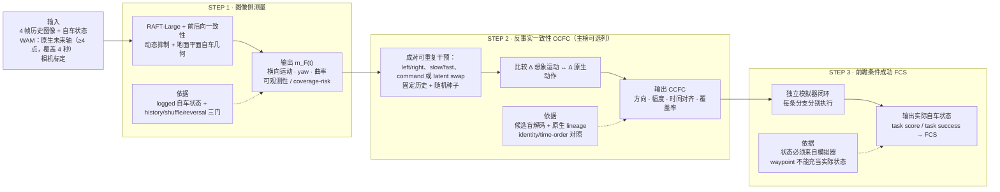

# IAC Benchmark · Release v1

中文文档：[README_zh.md](README_zh.md)

This GitHub branch is the reproducible benchmark package: clone it and run
`pip install -e .` from the repository root. Research notes and the old
78-sample workspace live on `main`; they are not part of this release.

IAC (Imagined-future and Action Consistency) is a reproducible benchmark for
testing whether a WAM's imagined future is aligned with the action it emits.
The package contains the **Step 1 continuous image-side measurement** and the
submission/scorecard contracts for Step 2 and Step 3: a
candidate-blind geometry probe extracts forward/lateral motion, heading and
curvature from an image sequence, then compares those signals with the WAM's
future action/trajectory. It is a measurement layer, not a claim of causality
by itself.

## Submission scope

The unified protocol evaluates WAMs that provide both **native action output**
and a **future visual state**. The latter may be future RGB frames or a future
latent that can be reconstructed to RGB with a fixed, checksummed decoder. Joint
video-action generation, a shared head, semantic clear/risk interventions and
video generation at deployment are not hard requirements. The required fields,
lineage rules and intervention taxonomy are defined in
[`docs/WAM_SCOPE_AND_UNIFIED_PROTOCOL_V1_ZH.md`](docs/WAM_SCOPE_AND_UNIFIED_PROTOCOL_V1_ZH.md).

## Method architecture: Step 1 → Step 3



Editable diagram source: [`docs/IAC_FROZEN_PIPELINE_V1.mmd`](docs/IAC_FROZEN_PIPELINE_V1.mmd).

The levels are cumulative but answer different questions:

| Step | Design intent | Evidence boundary |
|---|---|---|
| **Step 1** | Establish a trustworthy, candidate-blind ruler for future motion | Image-derived motion agrees with an independent logged reference; this validates measurement, not WAM causality |
| **Step 2 / CCFC** | Test whether an intervention changes imagined motion and native action in the corresponding way | Compare `Δ imagined motion` with `Δ native action` under fixed history/seed; this is a main leaderboard column when available |
| **Step 3 / FCS** | Test whether that consistency survives execution in the environment | Add an independent rollout, realized state and explicit task-success label; this is the causal-closure layer |

### What Step 1 contains

For each 4-second window, the frozen benchmark uses 4 history and 8 reference future
frames; submitted WAM outputs retain their native future axis (at least 4 points):

```text
RAFT-Large forward/backward flow
  → consistency checks and dynamic suppression
  → calibrated ground-plane ego geometry
  → camera intrinsics/extrinsics and distortion
  → candidate-blind continuous decoder
  → observability gate and abstention
  → lateral motion, yaw rate and curvature posterior
  → final comparison with action-waypoint kinematics
```

The action or waypoint is withheld from the image decoder and is read only at
the final comparison stage. Absolute speed, acceleration and metric forward
distance remain diagnostic in v1; the formal ruler is lateral motion, yaw rate,
curvature, observability and coverage-risk.

### What CCFC means

**CCFC (Continuous Counterfactual Foresight Consistency)** measures whether a
reproducible intervention changes a WAM's imagined future and native action in
the same direction and with compatible timing. With the same history, prompt,
seed and nuisance settings, run two forwards with any supported intervention,
such as left/right, slow/fast, command change or latent swap:

```text
ΔP_F(t) = P_F,branch1(t) − P_F,branch0(t)
ΔP_A(t) = P_A,branch1(t) − P_A,branch0(t)
CCFC    = consistency(ΔP_F, ΔP_A)
```

The report includes direction, magnitude, temporal alignment and coverage.
Wrong-identity and time-reversal controls test whether the response depends on
future content and its order rather than on a cache-presence artefact. Semantic
clear/risk is useful but is not a hard requirement.

### What FCS means

**FCS (Foresight-Conditioned Success)** is a downstream execution metric. It
feeds the WAM's submitted native action into an independent NAVSIM/PDM rollout
and measures the realized task outcome; the rollout does **not** read the WAM's
generated future images:

```text
imagined future → native action → independent simulator
                                  → realized state → task success
```

The realized state must come from the simulator, never from the WAM waypoint.
Missing task labels or an incompatible simulator are `unavailable`, never zero.
FCS therefore must not be interpreted by itself as proof that the action was
caused by the imagined future; CFAC/CCFC provide the visual-action evidence.

## Main leaderboard columns

The public scoreboard is capability-stratified. It does not average unavailable
capabilities into zero or force every WAM to expose the same intervention API:

| Column | Evidence | If unsupported |
|---|---|---|
| **CFAC** | single-run imagined motion vs native action | `unavailable` |
| **CCFC** | paired intervention: `ΔP_F` vs `ΔP_A` | `unavailable` |
| **FAU_F / FAU_A / FAU** | both imagined motion and action compared with private GT; `FAU=sqrt(FAU_F×FAU_A)` | `unavailable` |
| **FCS** | independent simulator rollout and task label | `unavailable` |
| **Coverage** | valid samples for each column | always reported |

CCFC is a formal main metric, but optional. `missing` means a claimed capability
has incomplete evidence; `ineligible` is reserved for a hard protocol violation.

## Release contents

```text
.
├── configs/         frozen RAFT-Large ground-plane configuration
├── datasets/        public, path-sanitised benchmark/dev manifests and audits
├── docs/            frozen benchmark protocol and Step 1 main table
├── scripts/         dataset builders, audits and scorers
├── src/iac_new/     reusable Step 1 geometry, flow and scoring library
├── tests/           deterministic unit and protocol tests
├── weights/         frozen RAFT-Large checkpoint + checksum
├── pyproject.toml
├── VERSION
├── README.md
└── README_zh.md
```

The role of each directory is fixed as follows:

| Path | Role | Required for reproduction |
|---|---|---|
| `configs/` | Frozen image-side geometry configuration (`plane.json`) | Yes |
| `datasets/` | Leakage-safe public manifests and split audits | Yes (metadata) |
| `docs/` | Frozen protocol, dataset contract and main-table definitions | Yes (protocol) |
| `scripts/` | Manifest builders, WAM-output audits and Step 1 scorers | Yes |
| `src/iac_new/` | Reusable flow, geometry, posterior and scoring implementation | Yes |
| `tests/` | Deterministic unit and protocol checks | Recommended |
| `weights/` | Frozen RAFT-Large checkpoint, provenance and SHA-256 checksums | Yes for the default probe |
| `pyproject.toml`, `VERSION` | Python package metadata and release identity | Yes |

The package intentionally contains no raw camera frames, private paths, WAM
checkpoints or generated experiment logs. Those inputs are mounted through the
private manifest interface at evaluation time.

Raw NAVSIM/Waymo frames, private absolute paths, WAM checkpoints and generated
logs are deliberately excluded. They stay in the data storage area and are
referenced through the manifest interface, which prevents accidental leakage
and keeps the GitHub package portable.

## Frozen protocol

- The frozen benchmark reference contains four history frames (`t <= 0`) and
  eight future frames at `0.5, …, 4.0 s`. A WAM submission may retain its native
  future axis as long as it has at least four points covering 4.0 s (DriveWAM's
  four-point, 1 Hz axis is valid). The public manifests do **not** contain
  future images; they contain only protocol metadata and sanitised identity.
- Exact timestamps, camera intrinsics/extrinsics and distortion are required.
- Scene/log groups are disjoint between benchmark and dev; split construction
  is deterministic and audited.
- Current internal freeze: 500 NAVSIM + 80 Waymo benchmark records and
  250 NAVSIM + 20 Waymo dev records (580/270 total). The Waymo expansion is
  continuing outside this release; it will become v2 after audit.
- Strata include stop, braking, acceleration, lateral-turn and straight-cruise
  so performance is not dominated by straight driving.

The public JSONL manifests retain sample identity, split, stratum, timestamps,
calibration and history state, while omitting raw image paths and future ground
truth. Use the private data root configured by your local environment to attach
frames at run time.

## Install and verify

```bash
python -m pip install -e .
PYTHONPATH=src:. python -m pytest tests -q
sha256sum -c weights/SHA256SUMS.txt
```

The test suite is deterministic and covers calibration interfaces, temporal
geometry, flow reliability, trajectory decoding, split isolation and the
Step 1 continuous scorer.

## Run Step 1 measurement

On the evaluation server, first run the frozen image decoder on WAM-generated
future-image records with `configs/plane.json`, producing a decoder-score JSONL.
The public manifests alone cannot be scored because their future images and
future reference states remain private. Action/trajectory fields are read only
at the final comparison stage and must not be passed to the image-side decoder.

```bash
python scripts/audit_wam_level1_outputs.py --generated <wam_generated_records.jsonl> \
  --output <wam_output_audit.json>
python scripts/evaluate_continuous_decoder.py \
  --manifest <private_wam_generated_records.jsonl> \
  --config configs/plane.json \
  --output <decoder_scores.jsonl>
python scripts/evaluate_continuous_motion_alignment.py \
  --manifest <private_evaluation_manifest.jsonl> \
  --scores <decoder_scores.jsonl> \
  --reference-source action \
  --output <out_dir>
```

The report contains path-normalised lateral/heading/curvature errors,
candidate-blind observability and coverage-risk. Speed is diagnostic only in
v1; it is not a formal Step 1 score. CCFC accepts any reproducible paired
intervention (for example left/right, slow/fast, command changes or latent
swap) and reports the intervention type. FCS additionally requires an
independent rollout and an explicit task-success label. Semantic clear/risk is
valuable but optional. Unsupported optional cells are `unavailable`; only hard
protocol violations are `ineligible`.

## Submit a WAM

Authors submit JSONL against `datasets/benchmark_v1_public.jsonl`. The schema,
legacy capability fields and scorecard rules are in
`docs/WAM_SUBMISSION_V1_ZH.md`; the current visual-action admission protocol is
in `docs/WAM_SCOPE_AND_UNIFIED_PROTOCOL_V1_ZH.md`. Validate locally with:

```bash
python scripts/validate_wam_submission.py \
  --public datasets/benchmark_v1_public.jsonl \
  --submission <submission.jsonl> \
  --output <audit.json>
python scripts/score_iac_submission.py --frozen-pilots --output scorecard.json
```

The official v1 board (`datasets/scorecard_v1.json`) records WorldDrive,
DriveWAM, Epona and DriveVA as capability-stratified pilots. CCFC/FAU/FCS cells
are populated only when the required evidence exists; otherwise they are
`unavailable`, never fabricated as zero.
The previous DriveWAM CFAC/CCFC/FAU values used an unvalidated metric
longitudinal scale and are now retained only as `legacy_diagnostic_score`; they
are excluded from the formal score until shape/relative recomputation. The
formal score uses lateral, yaw, curvature, and relative/arc-length shape.

## Step 1 metric summary

The following is the **new frozen `benchmark_v1` experiment**, evaluated on
580 records (500 NAVSIM + 80 Waymo), with strict shape gating and shape
fallback disabled. The reference is logged future ego state, so these numbers
validate the image measurement layer; they are not WAM causal scores.

| Metric | Result | Interpretation |
|---|---:|---|
| Non-stop shape coverage | **440/468 = 94.0%** | At least one shape interval is observable on most moving samples |
| Stop recognition | **92/112 = 82.1%** | Stop is reported by the dedicated stop layer, not by a fake velocity estimate |
| Lateral-speed MAE / within tolerance | **0.095 m/s / 98.4%** | Reliable lateral-motion amplitude (`0.50 m/s` tolerance) |
| Yaw-rate MAE / within tolerance | **0.029 rad/s / 97.0%** | Reliable heading-change measurement (`0.15 rad/s` tolerance) |
| Curvature MAE / within tolerance | **0.022 1/m / 86.1%** | Usable curvature measurement (`0.06 1/m` tolerance), with a heavier tail |
| Turn-layer yaw increment | **Gate passed** (106/114 evaluable) | Future content improves over history, matched-shuffle and reversal controls |
| Turn-layer curvature increment | **Gate passed** (106/114 evaluable) | Curvature uses the correct future and its temporal order |
| Full-pool curvature increment | **Gate passed** | The curvature signal remains specific on the mixed benchmark pool |

The formal Step 1 comparison therefore uses lateral motion, yaw rate and
curvature. Absolute speed, acceleration and metric forward distance remain
diagnostic only. The complete definitions, tolerances and bootstrap-gate
wording are frozen in
[`docs/LEVEL1_MAIN_TABLE_BENCHMARK_V1_ZH.md`](docs/LEVEL1_MAIN_TABLE_BENCHMARK_V1_ZH.md).

### Reliability and long-tail diagnostics

The 78-sample development audit is retained only to expose failure modes and
coverage. It reports mean interval observability **77.2%**, fully observable
sample rate **61.5%**, and overall core-pass rate **82.1%**. Strong turns are
observable (interval coverage **100%**) but have only **40.0%** core-pass rate;
the limitation is accumulated lateral error, not invisibility. On the
scene-aware non-overlap 25-sample audit, core-pass rate is **88.0%** and
interval coverage **58.5%**, but braking has only one sample. These diagnostics
must not be merged into the frozen 580-record headline or used to claim
causality.

## Dataset preparation

Use `scripts/build_level1_benchmark_v1.py` to construct deterministic splits
from private NAVSIM/Waymo records. `scripts/prepare_waymo_level1_samples.py`
converts Waymo Perception v2 shards to the 4+8-frame interface, and
`scripts/build_public_benchmark_manifest.py` creates a leakage-safe public
manifest. See `docs/BENCHMARK_DATASET_V1_ZH.md` for the data protocol and
`docs/LEVEL1_MAIN_TABLE_BENCHMARK_V1_ZH.md` for the frozen main table.

## Data and license

This repository contains code, manifests and third-party optical-flow weights.
NAVSIM and Waymo data remain subject to their original access terms and are
not redistributed here. Check `weights/README.md` for checkpoint provenance and
upstream licenses.
