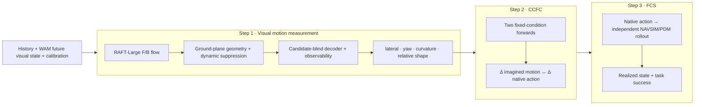

# IAC Benchmark: Imagined-future and Action Consistency

**Release:** `benchmark-v3` · **1,000 non-overlapping NAVSIM windows**

**Repository:** [RiseBun/IAC-iclr](https://github.com/RiseBun/IAC-iclr/tree/benchmark-release-v1)

**中文文档:** [README_zh.md](README_zh.md)

IAC is an evaluation protocol for world action models (WAMs). It asks a
specific question: when a model emits a native action, is that action aligned
with the future visual state the model predicts? IAC separates measurement,
intervention consistency, and execution instead of collapsing them into a
single video-quality or task-success number.

This repository is the reproducible release package. It contains no raw
NAVSIM/Waymo frames, private ground truth, WAM checkpoints, or generated video.
Those inputs are attached by the evaluation server through the manifest
interface. Waymo is an external-domain protocol, not part of the v3 leaderboard.

## Contributions

1. **Candidate-blind continuous ruler.** A frozen RAFT-Large plus calibrated
   ground-plane geometry recovers lateral motion, heading rate, curvature and
   normalized relative path shape from future images without reading the WAM's
   candidate trajectories. Forward/backward consistency, dynamic suppression,
   observability and abstention are part of the measurement contract.
2. **Capability-stratified metrics.** CFAC, CCFC, FAU and FCS are reported as
   separate evidence columns with per-column coverage. Unsupported capabilities
   are `unavailable`, not zero-filled.
3. **Fail-closed reproducibility.** Exact timestamps, calibration, model
   revision, seed and lineage are required. Private GT is joined only on the
   evaluation server; submitted motion profiles cannot replace image probing.

The release does **not** claim a new optical-flow architecture. The novelty is
the leakage-resistant measurement and scoring protocol built around a frozen,
audited flow component.

## Three-step protocol



### Step 1: visual motion measurement

The frozen v3 coordinate contract is decoder images at `448×256`, with RAFT
inference at `512×288` and flow mapped back to decoder coordinates. The default
configuration is [`configs/plane.json`](configs/plane.json). The formal motion
fields are:

```text
future RGB (or a fixed, checksummed latent decoder)
  → RAFT-Large forward/backward flow
  → consistency and dynamic masks
  → calibrated ground-plane ego geometry
  → candidate-blind continuous decoder
  → observability / abstention
  → lateral motion, yaw rate, curvature and relative arc shape
```

Metric forward distance, absolute speed and acceleration are diagnostic only in
this release because their monocular scale error exceeds the frozen error
budget. Stop samples are reported by the stop layer and excluded from moving
motion averages.

### Step 2: CFAC and CCFC

**CFAC** compares one run's imagined motion profile `P_F` with its native action
profile `P_A`. **CCFC** compares the changes produced by two reproducible
forwards with the same history, seed and nuisance variables:

```text
ΔP_F = P_F(branch 1) − P_F(branch 0)
ΔP_A = P_A(branch 1) − P_A(branch 0)
CCFC = consistency(ΔP_F, ΔP_A)
```

Any auditable intervention is allowed (for example left/right, slow/fast,
command change or latent swap). Semantic clear/risk is optional. The evaluator
must receive both regenerated future visual output and native action; injecting
an action after generation is only an action-response diagnostic, not CCFC.

FAU reports whether imagined motion (`FAU_F`) and native action (`FAU_A`) each
approach the private ground-truth future; `FAU = sqrt(FAU_F × FAU_A)`.

### Step 3: FCS

FCS sends native action to an independent simulator and scores the realized
state and task label. The rollout never reads generated future images, and a
WAM waypoint is never treated as realized state. Without a compatible rollout
or task label, FCS is `unavailable`.

## v3 benchmark

The frozen main split is [`datasets/benchmark_v3_public.jsonl`](datasets/benchmark_v3_public.jsonl):

| Property | Frozen value |
|---|---:|
| Samples | 1,000 NAVSIM windows |
| History | 4 frames, `t ≤ 0` |
| Future reference axis | 8 frames, `0.5 … 4.0 s` |
| Straight cruise | 300 (30% hard cap) |
| Lateral turn | 503 |
| Acceleration | 82 |
| Braking | 65 |
| Stop | 50 (5% cap) |
| Scene groups | 675 |
| In-scene window separation | ≥12 frames |

Selection and leakage audits are in
[`docs/BENCHMARK_V3_PROTOCOL_AUDIT_20260904_ZH.md`](docs/BENCHMARK_V3_PROTOCOL_AUDIT_20260904_ZH.md).
The historical 580-record NAVSIM+Waymo pool is retained only as a pilot.

## Reference DriveWAM run

The first complete v3 pilot used DriveWAM with the native LingBot-VA base. These
values are an example of the protocol, not an oracle or a claim that every WAM
must expose every column:

| Column | Score | Validity |
|---|---:|---|
| CFAC (shape composite) | 0.7638 | 823/1,000 |
| CCFC (arc-relative command intervention) | 0.2178 | 453/1,000 pairs |
| FAU_F | 0.5449 | 823/1,000 |
| FAU_A | 0.4904 | 823/1,000 |
| FAU | 0.5169 | 823/1,000 |
| FCS | 0.5143 | 503 successes / 978 executable rows |

Full provenance and per-sample artifacts are documented in
[`docs/DRIVEWAM_BENCHMARK_V3_RESULTS_20260905_ZH.md`](docs/DRIVEWAM_BENCHMARK_V3_RESULTS_20260905_ZH.md).

## Repository layout

```text
configs/       frozen evaluator configuration (`plane.json`)
datasets/      public v3 manifest, split audit and scorecard schema
docs/          protocol, dataset, metric and reproducibility specifications
scripts/       submission audit, manifest builders and evaluation entrypoints
src/iac_new/   reusable flow, geometry, decoder and scoring library
tests/         deterministic unit and protocol tests
weights/       frozen RAFT-Large checkpoint, provenance and SHA-256
```

Raw data, private GT, generated videos, WAM weights and server paths are
intentionally excluded.

## Install and verify

```bash
python -m pip install -e .
PYTHONPATH=src:. python -m pytest -q
sha256sum -c weights/SHA256SUMS.txt
```

## Submit and score a WAM

Each row must match a public `sample_id` and contain native action, future RGB
(or decoder-reconstructable latent), exact future timestamps, calibration, seed,
model revision and lineage. At least four future points must cover approximately
four seconds; the native axis is preserved (DriveWAM's four points at 1 Hz is
valid). Future images and private GT are never included in the public manifest.

```bash
python scripts/validate_wam_submission.py \
  --public datasets/benchmark_v3_public.jsonl \
  --submission <submission.jsonl> \
  --output <audit.json>

python scripts/score_iac_submission.py \
  --public datasets/benchmark_v3_public.jsonl \
  --submission <submission.jsonl> \
  --measurements <server_measurements.json> \
  --output <scorecard.json>
```

The server-only Step 1 command consumes a private joined manifest and runs
`scripts/evaluate_continuous_decoder.py` with `configs/plane.json`; the public
manifest alone cannot access images or GT. Capability status is one of
`pass`, `pilot`, `unavailable`, `missing` or `ineligible`.

## License and data

Code is released under the repository license. The RAFT checkpoint remains
subject to its upstream torchvision license (see [`weights/README.md`](weights/README.md)).
NAVSIM and Waymo data are not redistributed; users must obtain them under their
own terms.
