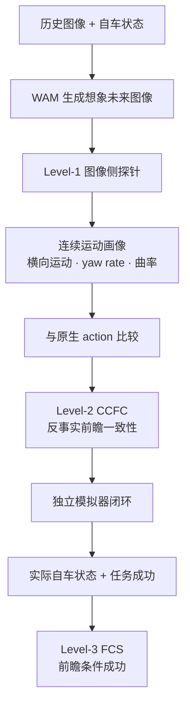

# IAC Benchmark · Level-1 发布版 v1

English version: [README.md](README.md)

本 GitHub 分支**就是** Level-1 发布包：克隆后在仓库根目录执行
`pip install -e .`。研究笔记和旧 78 条工作区在 `main`，不属于本发布。

IAC（Imagined-future and Action Consistency）是一个用于评测世界动作模型
（WAM）的可复现基准，目标是检查模型想象的未来是否与其输出动作保持一致。

本发布版提供 **Level-1 连续图像侧测量层**：使用候选盲的几何探针，从图像序列
中提取前向/横向运动、航向和曲率，再与 WAM 的未来动作或轨迹进行比较。它是
可靠的测量层，但单独不能宣称已经证明因果一致性。

## 方法架构：Level-1 → Level-3



三层是递进关系，但回答的问题不同：

| 层级 | 设计意图 | 证据边界 |
|---|---|---|
| **Level-1** | 建立可靠、候选盲的未来运动测量尺 | 图像测量与独立 logged 真值一致；验证测量器，不证明 WAM 因果性 |
| **Level-2 / CCFC** | 检查想象未来变化是否带来相应的原生动作变化 | 固定历史/随机种子比较 `Δ 想象运动` 与 `Δ 原生动作`；这是前瞻→动作桥梁，不是任务成功率 |
| **Level-3 / FCS** | 检查一致性在真实执行后是否仍然成立 | 加入独立 rollout、实际状态和任务成功标签；这是因果闭环层 |

### Level-1 使用的技术

对每个“4 帧历史 + 8 帧未来、4 秒”的窗口，冻结探针执行：

```text
RAFT-Large 前后向光流
  → 前后向一致性与动态抑制
  → 标定的地面平面自车几何
  → 相机内参/外参与畸变
  → 候选盲连续解码器
  → 可观测性门与 abstention
  → lateral motion、yaw rate、curvature 后验
  → 最后才与 action waypoint 的运动学量比较
```

动作或 waypoint 不会进入图像解码器，只在最后比较阶段读取。v1 中绝对速度、
加速度和米制前向距离仍是诊断项；正式测量尺是横向运动、yaw rate、曲率、
可观测性和 coverage-risk。

### CCFC 是什么

**CCFC（Continuous Counterfactual Foresight Consistency，连续反事实前瞻一致性）**
检验“想象未来是否真正参与了动作”。固定历史、提示、随机种子和其他干扰因素，
构造成对的 clear/risk 或 left/right 干预：

```text
ΔP_F(t) = P_F,risk(t) − P_F,clear(t)
ΔP_A(t) = P_A,risk(t) − P_A,clear(t)
CCFC    = consistency(ΔP_F, ΔP_A)
```

报告方向、幅度、时间对齐和覆盖率；wrong-identity 与 time-reversal 对照用于检验
响应是否依赖未来内容及其时间顺序，而不是仅仅因为 cache 存在。

### FCS 是什么

**FCS（Foresight-Conditioned Success，前瞻条件成功）**检验前瞻—动作一致性在
车辆真正执行后是否仍然成立：

```text
想象未来 → 原生动作 → 独立模拟器
                         → 实际状态 → 任务成功
```

实际状态必须由模拟器独立产生，不能直接使用 WAM waypoint。缺少任务标签时报告
`unavailable`，不能记为 0 分。因此 FCS 不是视频质量分数，也不是单独的规划分数，
而是对“想象未来—动作—执行”整条链的最终检验。

## 发布包结构

```text
.
├── configs/         冻结的 RAFT-Large 地面平面配置
├── datasets/        脱敏后的 benchmark/dev manifest 与审计文件
├── docs/            冻结的 benchmark 协议与 Level-1 主表
├── scripts/         数据集构建、审计和 scorer
├── src/iac_new/     Level-1 几何、光流与评分库
├── tests/           确定性的单元测试与协议测试
├── weights/         冻结的 RAFT-Large 权重及校验和
├── pyproject.toml
├── VERSION
├── README.md        English documentation
└── README_zh.md     中文文档
```

各目录的职责是冻结的：

| 路径 | 作用 | 复现是否需要 |
|---|---|---|
| `configs/` | 冻结的图像侧几何配置（`plane.json`） | 是 |
| `datasets/` | 无泄漏公开 manifest 与 split 审计文件 | 是（元数据） |
| `docs/` | 冻结的评测协议、数据契约和主表定义 | 是（协议） |
| `scripts/` | manifest 构建、WAM 输出审计和 Level-1 scorer | 是 |
| `src/iac_new/` | 光流、几何、后验与评分的可复用实现 | 是 |
| `tests/` | 确定性的单元测试与协议测试 | 建议运行 |
| `weights/` | 冻结 RAFT-Large 权重、来源和 SHA-256 校验和 | 是（默认探针） |
| `pyproject.toml`、`VERSION` | Python 包元数据与发布版本标识 | 是 |

包内明确不放置原始相机帧、私有绝对路径、WAM checkpoint 或生成日志。
评测时通过私有 manifest 接口挂载这些输入。

原始 NAVSIM/Waymo 图像、私有绝对路径、WAM checkpoint 和实验日志均未放入
发布包。它们仍保存在数据存储区，并通过 manifest 接口在运行时挂载，以避免
数据泄漏、版权问题和不必要的仓库膨胀。

## 固定评测协议

- 评测服务器上的私有输入包含 4 帧历史图像（`t <= 0`）和 8 帧未来图像。
  本公开包中的 manifest **不包含未来图像**，只包含协议元数据和脱敏后的样本身份。
- 未来帧时间为 `0.5, 1.0, ..., 4.0 s`，必须保留精确时间戳。
- 必须提供相机内参、外参和畸变参数。
- benchmark 与 dev 按 scene/log group 隔离，构建过程确定性且有审计文件。
- 当前冻结版本包含：benchmark 500 条 NAVSIM + 80 条 Waymo；dev 250 条 NAVSIM
  + 20 条 Waymo，共 580/270 条。
- 样本分层包含停车、制动、加速、横向转弯和直行巡航，避免被直行样本主导。

公开 manifest 保留样本身份、split、stratum、时间戳、标定和历史状态，但移除
原始图像路径及未来真值。运行时需要在本地环境中配置私有数据根目录。

## 安装与验证

```bash
python -m pip install -e .
PYTHONPATH=src:. python -m pytest tests -q
sha256sum -c weights/SHA256SUMS.txt
```

测试覆盖标定、时序几何、光流可靠性、轨迹解码、split 隔离以及 Level-1 连续
评分器。发布分支会在服务器环境中运行完整测试套件并记录结果。

## 运行 Level-1 评测

评测服务器上，先使用 `configs/plane.json` 对 WAM 生成的未来图像记录运行冻结的
图像解码器，得到 decoder-score JSONL。公开 manifest 没有未来图像和未来参考状态，
不能单独完成评分。动作或轨迹字段只能在最后的比较阶段读取，不能输入图像侧解码器。

```bash
python scripts/audit_wam_level1_outputs.py --generated <wam_generated_records.jsonl> \
  --output <wam_output_audit.json>
python scripts/evaluate_continuous_decoder.py \
  --manifest <private_wam_generated_records.jsonl> \
  --config configs/plane.json \
  --output <decoder_scores.jsonl>
python scripts/evaluate_continuous_motion_alignment.py \
  --manifest <private_evaluation_manifest.jsonl> \
  --scores <decoder_scores.jsonl> \
  --reference-source action \
  --require-eight-frame-four-second \
  --output <out_dir>
```

报告包括路径归一化后的横向、航向和曲率误差，候选盲可观测性以及 coverage-risk
曲线。速度仅作诊断，在 v1 中不属于正式 Level-1 主指标。CCFC/FCS 是记分板格子，
不是另一套包：没有语义双分支和独立 rollout 时必须标 `ineligible`，禁止填 0。

## 提交 WAM

作者按 `datasets/benchmark_v1_public.jsonl` 的 `sample_id` 提交 JSONL。字段、
能力层和记分规则见 `docs/WAM_SUBMISSION_V1_ZH.md`。

```bash
python scripts/validate_wam_submission.py \
  --public datasets/benchmark_v1_public.jsonl \
  --submission <submission.jsonl> \
  --output <audit.json>
python scripts/score_iac_submission.py --frozen-pilots --output scorecard.json
```

官方试点记分板为 `datasets/scorecard_v1.json`。当前 CCFC/FCS 全部 ineligible。

## Level-1 综合指标

下面是**新冻结的 `benchmark_v1` 实验结果**：共 580 条记录（NAVSIM 500 +
Waymo 80），使用严格形状门并关闭 shape fallback。参考值来自 logged future
ego state，因此这些数字验证的是图像测量层，不是 WAM 因果分数。

| 指标 | 结果 | 解释 |
|---|---:|---|
| 非停车形状覆盖 | **440/468 = 94.0%** | 大多数运动样本至少有一个形状区间可观测 |
| 停车识别 | **92/112 = 82.1%** | 由独立停车层报告，不用虚假的速度估计替代 |
| lateral-speed MAE / 容差内 | **0.095 m/s / 98.4%** | 横向运动幅度可靠（容差 `0.50 m/s`） |
| yaw-rate MAE / 容差内 | **0.029 rad/s / 97.0%** | 航向变化可靠（容差 `0.15 rad/s`） |
| curvature MAE / 容差内 | **0.022 1/m / 86.1%** | 曲率可用，但长尾误差更重（容差 `0.06 1/m`） |
| 转弯层 yaw 增量 | **通过**（106/114 可评） | 相比 history、错未来和倒序对照，正确未来更好 |
| 转弯层 curvature 增量 | **通过**（106/114 可评） | 曲率依赖正确 future 及其时间顺序 |
| 全池 curvature 增量 | **通过** | 混合 benchmark 上仍保持增量特异性 |

因此，正式 Level-1 比较使用 lateral motion、yaw rate 和 curvature。绝对速度、
加速度以及米制前向距离仍只作诊断。完整定义、容差和 bootstrap gate 见
[`docs/LEVEL1_MAIN_TABLE_BENCHMARK_V1_ZH.md`](docs/LEVEL1_MAIN_TABLE_BENCHMARK_V1_ZH.md)。

### 可靠性与长尾诊断（开发集，不是正式主分）

78 条开发审计用于暴露失败模式和覆盖率：平均区间可观测性 **77.2%**、全区间
可观测样本率 **61.5%**、总体核心通过率 **82.1%**。强转弯的区间可观测性为
**100%**，但核心通过率仅 **40.0%**，说明瓶颈是横向误差累积而不是“看不见”。
scene-aware 非重叠 25 条审计的核心通过率为 **88.0%**、区间覆盖率 **58.5%**，
但制动只有 1 条样本。这些诊断不能与 580 条正式主表合并，也不能用于宣称因果性。

## 数据准备

使用 `scripts/build_level1_benchmark_v1.py` 从私有 NAVSIM/Waymo 记录构建确定性
划分；使用 `scripts/prepare_waymo_level1_samples.py` 将 Waymo Perception v2
shard 转换为 4+8 帧接口；使用 `scripts/build_public_benchmark_manifest.py`
生成无泄漏的公开 manifest。

数据协议见 `docs/BENCHMARK_DATASET_V1_ZH.md`，冻结主表见
`docs/LEVEL1_MAIN_TABLE_BENCHMARK_V1_ZH.md`。

## 数据与许可证

本仓库发布代码、manifest 和第三方光流权重。NAVSIM 与 Waymo 数据仍受其原始
访问条款约束，本仓库不重新分发原始数据。权重来源和上游许可证见
`weights/README.md`。
