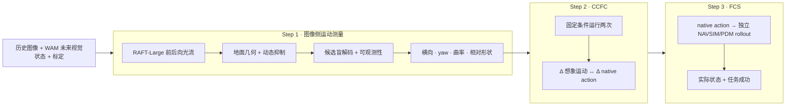

# IAC Benchmark：想象未来—动作一致性评测

**发布版本：** `benchmark-v3` · **1,000 条非重叠 NAVSIM 窗口**

**仓库：** [RiseBun/IAC-iclr](https://github.com/RiseBun/IAC-iclr/tree/benchmark-release-v1)

**English:** [README.md](README.md)

IAC 是面向世界动作模型（WAM）的评测协议，回答一个明确问题：模型输出的
native action，是否与模型预测的未来视觉状态一致？IAC 将图像测量、干预一致性和
独立执行分开报告，不把视频质量或任务成功率误当成同一个指标。

本仓库是可复现发布包，不包含 NAVSIM/Waymo 原始图像、私有真值、WAM 权重或生成
视频。评测服务器通过 manifest 接口挂载这些输入。Waymo 只作为外部域泛化协议，
不进入 v3 主榜分母。

## 方法贡献

1. **候选盲连续测量尺：** 冻结 RAFT-Large 与标定地面平面几何，从未来图像中恢复
   横向运动、航向变化、曲率和归一化相对路径形状；前后向一致性、动态抑制、可观测
   性和 abstention 均属于协议的一部分，图像解码阶段不读取候选轨迹。
2. **能力分层指标：** CFAC、CCFC、FAU、FCS 作为独立证据列并报告各自 coverage；
   模型不支持某项时记为 `unavailable`，不填 0。
3. **失败关闭与可复现：** 强制精确时间戳、标定、随机种子、模型版本和 lineage；
   私有 GT 只在评测端 join，作者提交的运动剖面不能替代图像侧探针。

本发布版不宣称提出新的光流网络。创新点是围绕冻结、审计过的光流组件建立了防
泄漏的测量和评分协议。

## 三步流程



### Step 1：图像侧运动测量

v3 冻结坐标约定为：解码图像 `448×256`，RAFT 推理 `512×288`，光流再映射回
解码坐标。默认配置为 [`configs/plane.json`](configs/plane.json)：

```text
未来 RGB（或固定且有 checksum 的 latent decoder）
  → RAFT-Large 前后向光流
  → 一致性与动态掩码
  → 标定地面平面自车几何
  → 候选盲连续解码器
  → 可观测性 / abstention
  → 横向运动、yaw rate、曲率和相对弧长形状
```

由于单目米制尺度误差尚未达到冻结误差预算，米制前向距离、绝对速度和加速度在
本版本只作诊断。停车样本由独立停车层报告，不进入运动样本平均值。

### Step 2：CFAC 与 CCFC

**CFAC** 比较单次推理的想象运动剖面 `P_F` 和 native action 剖面 `P_A`。
**CCFC** 在相同历史、随机种子和 nuisance 下进行两次可复现推理，比较干预造成的
变化：

```text
ΔP_F = P_F(分支 1) − P_F(分支 0)
ΔP_A = P_A(分支 1) − P_A(分支 0)
CCFC = consistency(ΔP_F, ΔP_A)
```

任何可审计干预均可使用，如 left/right、slow/fast、command 变化或 latent swap；
semantic clear/risk 不是硬条件。评测端必须收到干预后重新生成的 future visual 和
native action；生成后直接注入动作只能记为 action-response 诊断，不能记为 CCFC。

FAU 分别比较想象运动（`FAU_F`）和 native action（`FAU_A`）是否接近私有真实未来，
并定义 `FAU = sqrt(FAU_F × FAU_A)`。

### Step 3：FCS

FCS 将 native action 输入独立模拟器，依据模拟器产生的实际状态和任务标签评分。
rollout 不读取 WAM 生成图像，WAM waypoint 也不能冒充实际状态。没有兼容 rollout 或
任务标签时，FCS 为 `unavailable`。

## v3 数据集

冻结主集为 [`datasets/benchmark_v3_public.jsonl`](datasets/benchmark_v3_public.jsonl)：

| 属性 | 冻结值 |
|---|---:|
| 样本 | 1,000 条 NAVSIM 窗口 |
| 历史 | 4 帧，`t ≤ 0` |
| 未来参考轴 | 8 帧，`0.5 … 4.0 s` |
| 直行巡航 | 300（30% 硬上限） |
| 横向转弯 | 503 |
| 加速 | 82 |
| 制动 | 65 |
| 停车 | 50（5% 上限） |
| scene group | 675 |
| 同场景窗口间隔 | ≥12 帧 |

选集和泄漏审计见
[`docs/BENCHMARK_V3_PROTOCOL_AUDIT_20260904_ZH.md`](docs/BENCHMARK_V3_PROTOCOL_AUDIT_20260904_ZH.md)。
历史 580 条 NAVSIM+Waymo 仅保留为 pilot。

## DriveWAM v3 参考运行

首个完整 v3 pilot 使用 DriveWAM 及其原生 LingBot-VA base。以下是协议示例，不是
oracle，也不要求每个 WAM 都支持所有列：

| 指标 | 分数 | 有效性 |
|---|---:|---|
| CFAC（形状综合分） | 0.7638 | 823/1,000 |
| CCFC（弧相对 command 干预） | 0.2178 | 453/1,000 对 |
| FAU_F | 0.5449 | 823/1,000 |
| FAU_A | 0.4904 | 823/1,000 |
| FAU | 0.5169 | 823/1,000 |
| FCS | 0.5143 | 503 successes / 978 可执行行 |

完整来源和逐样本产物见
[`docs/DRIVEWAM_BENCHMARK_V3_RESULTS_20260905_ZH.md`](docs/DRIVEWAM_BENCHMARK_V3_RESULTS_20260905_ZH.md)。

## 仓库结构

```text
configs/       冻结评测配置（`plane.json`）
datasets/      v3 公开 manifest、split 审计和记分板结构
docs/          协议、数据集、指标和复现说明
scripts/       提交审计、manifest 构建和评测入口
src/iac_new/   光流、几何、解码器和评分库
tests/         确定性单元测试与协议测试
weights/       冻结 RAFT-Large、来源和 SHA-256
```

原始数据、私有 GT、生成视频、WAM 权重和服务器路径均有意排除。

## 安装与验证

```bash
python -m pip install -e .
PYTHONPATH=src:. python -m pytest -q
sha256sum -c weights/SHA256SUMS.txt
```

## 提交与评分

每行必须对应公开 `sample_id`，并包含 native action、未来 RGB（或可重建 latent）、
精确未来时间戳、标定、随机种子、模型版本和 lineage。至少 4 个未来点并覆盖约 4 秒，
保留模型原生时间轴（DriveWAM 的 4 点、1 Hz 合规）。未来图像和私有 GT 不进入公开
manifest。

```bash
python scripts/validate_wam_submission.py \
  --public datasets/benchmark_v3_public.jsonl \
  --submission <submission.jsonl> \
  --output <audit.json>

python scripts/score_iac_submission.py \
  --public datasets/benchmark_v3_public.jsonl \
  --submission <submission.jsonl> \
  --measurements <server_measurements.json> \
  --output <scorecard.json>
```

Step 1 的服务器命令使用私有 join manifest 和 `configs/plane.json`；公开 manifest
本身无法访问图像或 GT。能力状态为 `pass`、`pilot`、`unavailable`、`missing` 或
`ineligible`，不把缺失能力填为 0。

## 许可证、引用与数据

- 代码：[MIT License](LICENSE)
- 引用：[`CITATION.cff`](CITATION.cff)
- RAFT 权重：上游 torchvision 条款（[`weights/README.md`](weights/README.md)）
- NAVSIM / Waymo 原始数据**不**随包分发，需按各自条款自行获取

安装包名为 `iac-benchmark`，导入路径仍为 `iac_new`，以保持冻结评测脚本兼容。
