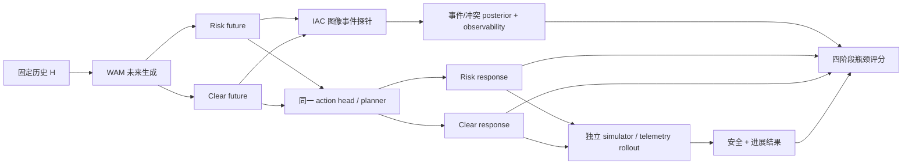
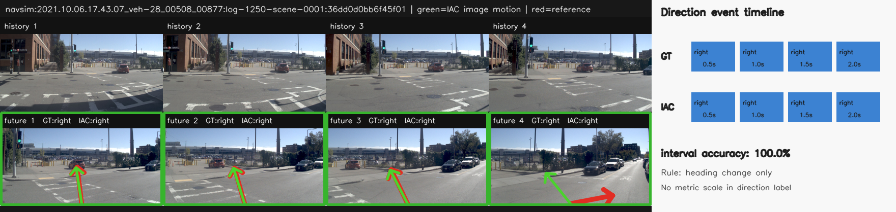
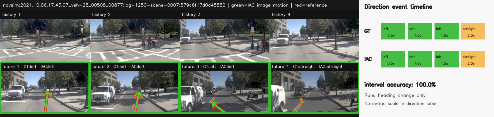
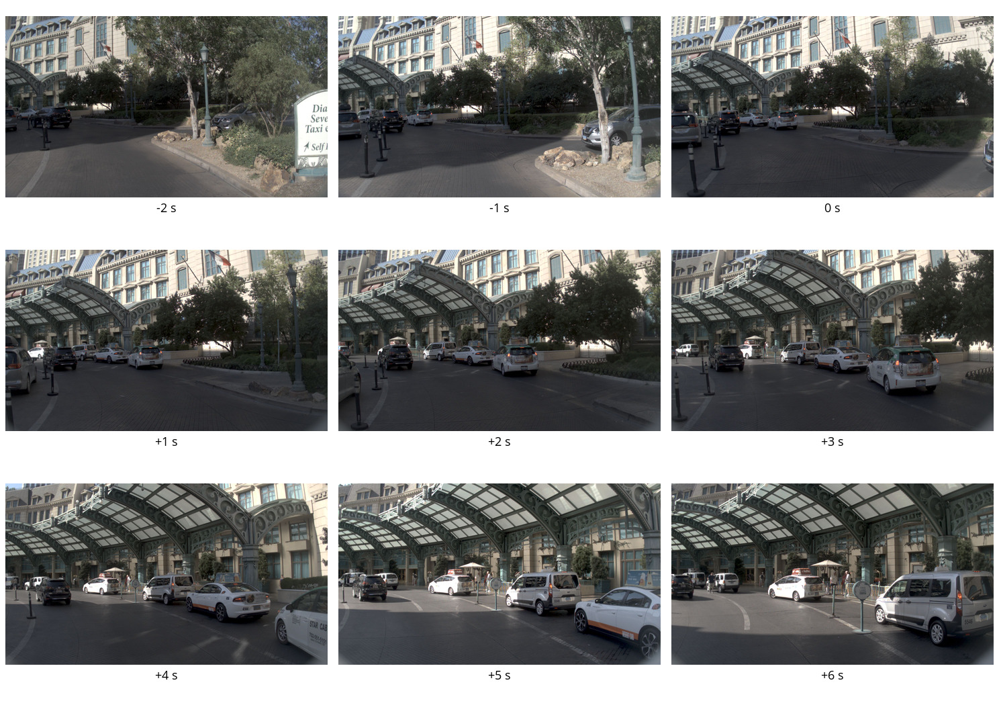
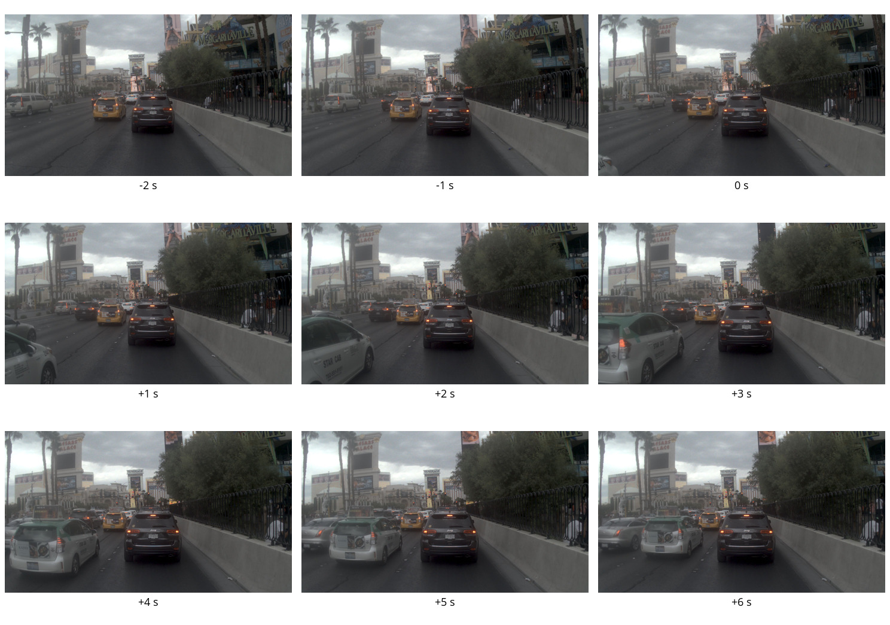
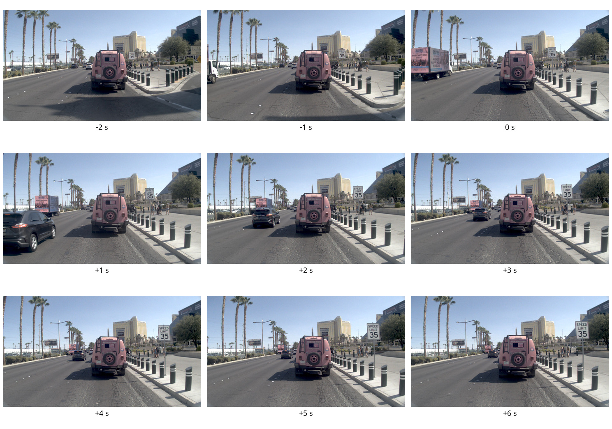
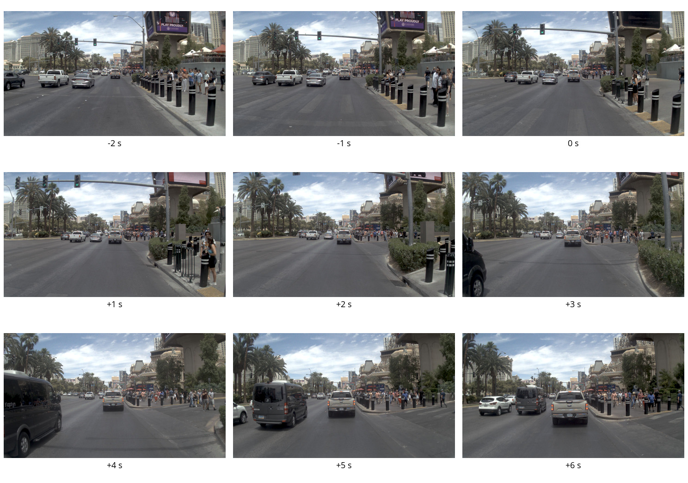

# IAC：面向 WAM 的事件级因果一致性评测与风险种子盲标方案 V1

更新日期：2026-08-26

## 一句话介绍

IAC 不试图从单目未来图像中精确恢复整条驾驶轨迹，而是恢复对决策真正必要的事件与冲突状态，并用同一历史下的 risk/clear 反事实检查：WAM 是否想象出了不同的未来、action head 是否真的因为这种差异改变动作、最终执行是否安全且保持进展。

## 1. 要解决的核心问题

当前自动驾驶 World Action Model（WAM）评测通常分成两类：

- 视频质量：未来图像是否清晰、真实、时序连贯。
- 任务指标：碰撞率、规划分数、到达率或闭环成功率。

两者都不能回答最关键的问题：动作是否真的由模型想象的未来驱动。

一个模型可能生成好看的视频，但 action head 完全忽略未来；也可能依赖反应式规则取得较高任务成功率，却没有使用世界模型的 foresight。因此我们的目标不是再增加一个视频质量分数，而是建立以下可审计因果链：

```text
外部触发事件
  -> WAM 想象到冲突或安全演化
  -> action head 选择与该未来匹配的响应
  -> 独立执行结果同时满足安全与进展
```

## 2. 为什么采用事件表示，而不是精确轨迹恢复

从前视单目图像精确恢复米制轨迹，需要同时解决深度、尺度、遮挡、相机标定、动态物体运动和自车运动分离。任何一个误差都可能污染最终轨迹，且很多 WAM 输出本身并不保证严格几何一致。

评测所需的最小充分信息实际上更弱：

- 是否出现转向、制动、停车、重启、换道或 gap acceptance。
- 是否有车辆、行人或障碍进入自车未来占用区域。
- 风险是增加还是消失，冲突何时出现、何时解除。
- 图像是否足以支持判断；不足时应 abstain，而不是猜测。

因此 IAC 输出事件 posterior 和可观察性，而不是伪精确轨迹。连续轨迹解码仍作为中间几何证据，但最终比较发生在事件与因果链层面。

## 3. 四类主因果链

四类不是互斥分类标签，而是四个包含 trigger、imagined consequence、response 和 outcome 的因果模板。每个模板都必须同时包含 risk 与 clear 对照。

| 因果链 | Trigger | 从图像恢复的关键状态 | Risk 响应 | Clear 响应 | 独立结果要求 |
|---|---|---|---|---|---|
| cut-in / lead brake | 邻车切入或前车制动 | 侵入自车走廊、TTC/headway 冲突 | 减速、紧急制动或让行 | 保持速度、跟车或合理加速 | 无碰撞且 TTC/headway 安全 |
| pedestrian crossing | 行人进入或即将进入通行区域 | 行人与自车未来占用冲突、清空时刻 | 让行/停车，清空后重启 | 路径清空时继续通行 | 安全间距/停车且恢复进展 |
| blocked lane | 锥桶、护栏、施工或静止物阻塞 | 障碍持续性、可行驶走廊及可绕行方向 | 换道、绕行或必要停车 | 车道清空时保持车道 | 无碰撞、可行驶区域合规且有进展 |
| unprotected turn / merge | 无保护转向或汇入交互 | 冲突车辆到达时间、gap 开闭与安全性 | 让行、停车或 creep | gap 安全时接受并通过 | 无碰撞、TTC 安全且有进展 |

这四类覆盖 WAM 最需要 foresight 的三种基本决策：纵向风险响应、横向避障和交互式 gap reasoning。普通直行与基础转向仍保留为控制项，但不应成为主因果指标。

## 4. 当前完整方法结构



### 4.1 当前最佳图像运动基线

现有冻结基线由以下组件共同构成，不只是 RAFT：

1. `RAFT-Large` 稠密光流，提取前视图像运动证据。
2. forward/backward consistency，剔除不可靠流和遮挡区域。
3. ground-plane ego geometry，把图像运动解释到自车坐标系。
4. candidate-blind continuous decoder，在不读取候选动作标签的情况下恢复连续运动形状。
5. observability/abstention，证据不足时降低覆盖率而不是输出高置信错误。
6. maneuver skeleton，把连续运动压缩为区间级转向、直行、制动、停车等结构。
7. event posterior，保留多模态不确定性，并进入 Event-CC、Event-FCS 和 FUI。

可选语义分割、动态区域和道路支持用于约束或诊断，但不是当前主分数的隐藏捷径。速度仍是诊断量，不作为现有横向主指标的核心证据。

### 4.2 从图像中需要恢复什么

新交互层不会要求完整 3D actor trajectory，而是恢复以下最小事件变量：

- `trigger posterior`：触发事件属于哪一类，是否真正出现。
- `conflict posterior`：collision risk、unsafe TTC/headway、occupancy conflict、obstruction 或 gap unsafe。
- `event timing`：trigger、conflict、response 和 resolution 的 onset/clear 时刻。
- `response event sequence`：制动、停车、重启、换道、绕行、让行或 gap acceptance。
- `observability`：每个阶段是否能从图像可靠观察，并允许阶段级 abstention。

当前 RAFT 基线已经验证的是自车运动和 maneuver event 恢复。车辆切入、行人占用、障碍持续性和 gap state 属于新的 interaction probe 能力，尚不能用 78 样本横向结果替代验证。

### 4.3 三个因果方向必须分开报告

| 层级 | 问题 | 指标 |
|---|---|---|
| Action → Future | 不同动作条件是否产生对应的未来事件 | Event Counterfactual Consistency（Event-CC） |
| Future ↔ Outcome | 想象事件与独立真实状态是否兼容且成功 | Event-FCS、Joint-FCS、coverage |
| Future → Action | 替换或改变 imagined future 后，action head 是否改变决策 | Future-Usage Intervention（FUI）/ imagined-future swap |

只有最后一项能直接检验 action head 是否使用 imagined future。对于无法重新输入或交换 future representation、无法固定 planner seed 重跑的封闭 WAM，只能报告较低能力等级，不能推断 FUI。

## 5. 如何比较 risk 与 clear

每个 `counterfactual_pair_id` 必须共享同一 `history_id`，并固定 planner、candidate bank 和 nuisance seed。risk/clear 两侧必须使用不同的 intervention、generated future 和 planner run 标识。

图像侧对比：

```text
imagined_risk_contrast
  = P(conflict | risk future) - P(conflict | clear future)
```

动作侧对比：

```text
protective_action_contrast
  = P(protective response | risk future)
  - P(protective response | clear future)
```

V1 默认两项都至少达到 `0.20` 才记为 `directionally_aligned`。pair 分数采用保守瓶颈：

```text
causal_chain_score = min(
  positive imagined-risk contrast,
  positive protective-action contrast,
  risk/clear 两侧期望想象支持度,
  risk/clear 两侧期望动作支持度,
  independent safe-outcome support
)
```

这一定义会把以下伪成功压到零或低分：

- WAM 想象出风险，但 action head 在 risk/clear 下动作完全相同。
- Action head 会刹车，但 imagined future 没有显示风险差异。
- 只避免碰撞，却永久停车、越出可行驶区域或不恢复进展。
- 只提交样本最多的一类，回避困难事件。

最终主数采用四类等权宏平均；缺少任意一类时 `macro_mean_causal_chain_score = null`。

## 6. 为什么先做风险种子盲标

正式反事实实验的前提是我们确实拥有可观察、可消解的交互场景。nuPlan scenario tag 适合高召回检索，但不能当作图像真值。例如 `near_pedestrian_on_crosswalk_with_ego` 可能只表示附近有行人，并不保证发生占用冲突；`starting_unprotected_cross_turn` 也不保证当前 6 秒片段出现可判断的 gap 演化。

因此第一轮只回答：真实前视片段中是否存在目标 trigger，之后能否观察 conflict、ego response 与 resolution。只有通过这一轮的 risk seed 才进入 risk/clear 构造。

## 7. 盲标数据契约

### 7.1 公开与私有信息分离

公开任务仅包含：

- 不透明 `item_id`。
- 统一重编码的时间序列图像。
- 相对时间 `frame_offsets_s`。
- 所有允许的 chain、response 与 resolution 答案集合。
- 空白标注模板。

私钥单独保存：

- 候选类别和 scenario tag。
- 原始 log、token、数据库和图片路径。
- `candidate_id` 与公开 `item_id` 的映射。
- 候选挖掘 provenance。

每条至少由 3 名标注者独立完成。全部标注冻结后才能解盲。无共识样本应被排除并降低 coverage，不能由 action condition 或 scenario tag 仲裁。

### 7.2 标注字段

| 字段 | 含义 |
|---|---|
| `clip_observable` | 整段是否具备基本可判性 |
| `chain_type` | 四类之一、`none_of_four` 或 `uncertain` |
| `trigger_present` | 是否直接看到触发事件 |
| `trigger_onset_offset_s` | 首次可见触发时刻 |
| `conflict_present` | 是否看到占用、TTC、障碍或 gap 冲突 |
| `conflict_onset_offset_s` | 首次可见冲突时刻 |
| `ego_response_events` | 可多选的自车响应事件序列 |
| `response_onset_offset_s` | 首次响应时刻 |
| `resolution_state` | 安全恢复通行、安全停车未消解、不安全、未观察到或不确定 |
| `resolution_offset_s` | 首次达到 resolution 的时刻 |
| `stage_observable` | trigger/conflict/response/resolution 分别是否可观察 |
| `confidence_1_to_5` | 标注置信度 |

标注者只能使用图像中可见证据，不能根据“自车在刹车”反推出“一定有行人或前车风险”。`none_of_four` 表示片段可观察但不属于四类；`uncertain` 表示证据本身有歧义。

### 7.3 当前时间采样的用途边界

当前种子筛选包包含 `-2,-1,0,+1,+2,+3,+4,+5,+6 s` 共 9 帧。它适合确认场景类别、风险存在和是否完整消解，但 1 秒间隔不足以支撑最终 event onset 精度。

通过筛选的样本必须从原始传感器数据重新抽取更高时间密度片段，用于 interaction probe 校准。正式 WAM 评测则使用各模型原生输出帧率，并把时间归一到秒，而不是把所有模型强制成相同帧数。

## 8. 服务器当前真实进展

### 8.1 候选挖掘

服务器 `iac` 上使用 nuPlan v1.1 mini 的 64 个 SQLite 日志库：

| 项目 | 数量 |
|---|---:|
| 与四类相关的 scenario-tag 候选 | 9,289 |
| 固定 seed、按 log 优先去重后的抽样 | 160 |
| 通过完整时间窗和图片存在性检查 | 31 |
| 缺完整时间窗 | 3 |
| 当前服务器缺对应 sensor blob | 126 |

31 条可读候选分布：

| 候选层级类别 | 数量 |
|---|---:|
| cut-in / lead brake | 7 |
| pedestrian crossing | 5 |
| blocked lane | 9 |
| unprotected turn / merge | 10 |

`vehicle_cut_in` 与 `merge_gap` 没有直接 nuPlan tag 覆盖，是当前明确的数据缺口；现有 7 条与 10 条主要覆盖 lead-vehicle 和 unprotected-turn 子类。

### 8.2 已生成的盲标包

服务器产物：

```text
候选清单:
~/iac_new/work_dirs/causal_chain_candidates_v1_20260826/candidates.jsonl

完整盲标包:
~/iac_new/work_dirs/causal_seed_blind_v1_20260826/

仅 public 分发包:
~/iac_new/work_dirs/causal_seed_blind_v1_20260826_public.tar.gz
```

冻结状态：

- 31 个公开任务，31 条私钥记录。
- 每条 9 帧，共 279 张图片。
- 全部中心裁剪并重编码为 `960 × 540 PNG`，移除来源格式差异。
- 279/279 图片尺寸检查通过。
- `public/SHA256SUMS.txt` 全量校验通过。
- `private/` 权限为 `700`，`private_key.jsonl` 权限为 `600`。
- 解包目录约 199 MB，public 压缩包约 190 MB。
- public 压缩包 SHA-256：`8d2f01d5463d26da0243fff1d1b1607d5ba22b953a362cbb52fa117336e682b3`。

## 9. 服务器可视化

### 9.1 当前 RAFT/event 基线能做什么

绿色箭头为 IAC 从图像运动恢复的方向事件，红色箭头为独立参考。右侧显示 0.5 秒区间的 GT/IAC event timeline。这两例说明现有基线可以恢复自车 maneuver event，但不等于已经识别交互冲突。





现有冻结 78 样本 NAVSIM 平衡集结果为：78 个样本、312 个区间、19 个 scene，方向事件 accuracy `0.977564`、macro-F1 `0.974382`、onset MAE `0.0 s`。这些数字只验证图像到自车 maneuver event 的测量能力，不是四类交互准确率，也不是最终 WAM 因果分数。

### 9.2 四类候选时间轴

以下图片按私钥中的候选分层各抽取一条，仅用于方案介绍。它们不是人工确认真值，严禁提供给盲标人员。

#### Blocked-lane 候选

可见路侧立柱、车辆和通行空间变化，但是否达到“车道阻塞并需要绕行”的定义仍需人工判断。



#### Cut-in / lead-brake 候选

左侧车辆在未来时刻进入更靠近自车走廊的位置，是需要标注 trigger 与 conflict onset 的典型候选；不能仅凭 scenario tag 直接判定 unsafe TTC。



#### Pedestrian-crossing 候选

路侧可见行人，但从稀疏帧中未必能确认行人进入自车占用走廊。这正是设置 `none_of_four`、`uncertain` 和阶段级 observability 的原因。



#### Unprotected-turn / merge 候选

片段处于复杂交互道路环境，但 6 秒内是否形成可判断的 gap evolution 仍不确定。候选检索与正式事件真值必须分开。



## 10. 当前证据等级与不能宣称的内容

| 内容 | 当前状态 | 可以宣称什么 |
|---|---|---|
| RAFT-Large 自车 maneuver event | 已冻结并在 78 样本验证 | 图像侧方向事件恢复基线有效 |
| CoTracker3 actor closing speed 上界 | 40 条场景去重、图像可见样本已验证 | vehicle 链可用；不能外推到所有事件 |
| 危险 TTC 正例 | 当前 40 条中为 0 | 不能报告 TTC recall/F1 |
| 四类候选挖掘 | 已完成首批 31 条可读候选 | 已建立真实数据入口 |
| 风险种子盲标包 | 已生成并通过泄漏/checksum/尺寸审计 | 可开始三人独立盲标 |
| 四类人工 gold set | 尚未完成 | 不能报告 interaction accuracy |
| 冻结 interaction probe | 尚未校准 | 不能用自动探针替代人工 imagined consequence |
| 同 history risk/clear future | 尚未构造 | 不能报告四类 counterfactual score |
| 固定 planner 的 action-head rerun | 尚未执行 | 不能宣称 imagined future 导致动作变化 |
| 独立闭环 outcome | 尚未补齐 | 不能报告最终联合 WAM 指标 |

所以目前最准确的项目表述是：框架、数据契约、失败关闭评分器、真实候选入口和首批盲标包已经完成；四类 interaction measurement validity 与 WAM 因果效应尚待实验验证。

## 11. 接下来的实验顺序

1. 用 actor mask 内多点共识修复 pedestrian/blocked-lane 的单点漂移，并保留可观测性弃权。
2. 定向挖掘 `corridor_conflict_ttc <= 4 s` 正例；没有正例时不计算 TTC recall/F1。
3. 三名标注者独立完成 risk-seed 任务，冻结文件后计算类别确认率、阶段可观察率、pairwise agreement 和 generalized kappa。
4. 用人工 gold set 校准 interaction probe，冻结阈值、abstention 和 scene-disjoint calibration/holdout split。
5. 为每个通过的 history 构造 risk/clear imagined future，固定 action head 的其他输入后重跑。
6. 接入独立 simulator/logged telemetry，补齐 collision、TTC/clearance、drivable-area compliance 与 progress。
7. 报告四类分别结果、等权宏平均、coverage、bootstrap 置信区间和 identical-future/action-swap/null controls。

## 12. 复现命令与代码入口

候选挖掘：

```bash
PYTHONPATH=src:. python scripts/mine_nuplan_causal_candidates.py \
  --db-root /path/to/nuplan-v1.1/splits/mini \
  --sensor-root /path/to/sensor_blobs \
  --output work/nuplan_causal_candidates.jsonl \
  --max-per-chain 40
```

盲标包生成：

```bash
PYTHONPATH=src:. python scripts/build_blind_causal_seed_pack.py \
  --candidates work/nuplan_causal_candidates.jsonl \
  --output-dir work/causal_seed_blind_pack
```

正式四类评分：

```bash
PYTHONPATH=src:. python scripts/evaluate_causal_chains.py \
  --records causal_chain_records.jsonl \
  --output work/causal_chain_report.json \
  --minimum-contrast 0.20 \
  --require-ready
```

主要代码：

- [`src/iac_new/causal_chains.py`](../src/iac_new/causal_chains.py)：四类 ontology、fail-closed audit 和评分器。
- [`src/iac_new/causal_annotation.py`](../src/iac_new/causal_annotation.py)：公开/私有盲标包生成与证据隔离。
- [`scripts/mine_nuplan_causal_candidates.py`](../scripts/mine_nuplan_causal_candidates.py)：nuPlan 高召回候选挖掘。
- [`scripts/build_blind_causal_seed_pack.py`](../scripts/build_blind_causal_seed_pack.py)：风险种子盲标包生成。
- [`scripts/evaluate_causal_chains.py`](../scripts/evaluate_causal_chains.py)：正式 risk/clear 因果链评分。

## 13. 对外介绍时的 60 秒版本

我们的目标不是评价 WAM 视频“像不像真的”，也不是只看规划成功率，而是检查模型想象的未来是否真正改变了动作。方法上，我们先用 RAFT-Large、前后向一致性、地平面几何、长程 actor tracker 和候选盲连续解码，从未来图像恢复事件 posterior；然后针对前车风险、行人横穿、车道阻塞和无保护转向/汇入四类场景，构造同一历史下的 risk/clear future，固定 action head 的其他条件重跑。只有未来冲突对比、动作响应对比和独立安全进展结果同时成立，样本才得分。当前方向事件已在 78 条上验证；相对速度的 oracle 上界显示 vehicle 链成立，但 pedestrian 和 blocked-lane 的单点跟踪失败，且还没有危险 TTC 正例。因此下一步是多点 actor 跟踪、危险正例补集和人工 gold set，而不是直接宣称联合指标已经有效。

## 14. Actor 相对运动服务器实测可视化（2026-08-27）

新建的 V2 参考集含四链各 10 个不同 scene，严格 8 帧/4 秒，并把 LiDAR 可见与
前视图像可见分开。CoTracker3 在首次可见帧用 LiDAR ground contact 做一次 oracle 初始化；
该帧及此前帧不计分，未来 action 和候选轨迹均不输入。执行 observability abstention 后，
总体帧覆盖率为 `76.2%`，closing-speed MAE 为 `0.625 m/s`。其中：

- `cut-in / lead brake`：100% 覆盖，`0.095 m/s`；
- `unprotected turn / merge`：76.9% 覆盖，`0.160 m/s`；
- `pedestrian crossing`：72.7% 覆盖，`0.974 m/s`，单点跟踪不可靠；
- `blocked lane`：43.8% 覆盖，`2.744 m/s`，速度不是合适主指标。

绿色圆圈为独立 LiDAR 投影，紫色十字为 CoTracker。车辆目标保持一致：


行人单 ground-contact 点锁住脚下纹理，没有随人体移动，直接说明下一版需要 actor mask 内
多点跟踪与鲁棒共识：


完整协议、按链指标、checksum 和另外两类可视化见
[`RELATIVE_MOTION_CAPABILITY_V1_ZH.md`](RELATIVE_MOTION_CAPABILITY_V1_ZH.md)。
