# IAC 连续前视—动作因果一致性 V1

> 当前工作已冻结事件层，集中完善
> [Level 1 连续前视—动作对齐 V2](LEVEL1_CONTINUOUS_ALIGNMENT_V2_ZH.md)。

## 1. 要解决的问题

视频质量高不等于动作正确，任务成功也不证明动作使用了模型想象的未来。IAC 要测量的是：

> WAM 在图像中想象出的自车运动变化，是否与 action head 输出的运动变化一致；改变风险条件后，两者是否发生方向、幅度和时序一致的响应。

因此，V1 不再把文字事件作为主信息，也不追求从单目前视图精确恢复世界坐标轨迹。主对象是可观测的连续自车运动曲线：

```text
m(t) = [v(t), a(t), v_lat(t), yaw_rate(t), curvature(t)]
```

其中速度和加速度是纵向主变量，横向速度、横摆角速度和曲率描述转向。事件只在最后由连续曲线派生，用于解释和分层。

## 2. 收敛后的唯一主流程



可编辑源文件见
[`continuous_foresight_alignment_v1.mmd`](figures/continuous_foresight_alignment_v1.mmd)，
高分辨率位图见
[`continuous_foresight_alignment_v1.png`](figures/continuous_foresight_alignment_v1.png)。

该图只有一条主信息流：连续量先完成测量和比较，事件在结果之后产生。行人或车辆识别不是主流程要求；它们仅在将来研究交互风险时作为可选扩展。

## 3. 两条分支如何隔离

### 图像分支

输入只允许历史信息和 WAM 未来图像。RAFT-Large 的前后向一致性、地面平面几何、候选无关解码器输出轨迹支持和每个区间的速度后验：

```text
q_F(v_t) = [q05, q50, q95], observability_t, status_t
```

`status_t` 只能是 `usable`、`uncertain` 或 `abstain`。低可观测区间不计作错误，而是降低 coverage。

### 动作分支

action head 的未来 waypoint 只能在图像解码完成后进入。对累计自车坐标 `[x_t,y_t,yaw_t]`，先在上一时刻车体坐标系分解位移，再计算：

```text
v_t        = ||p_t - p_(t-1)|| / dt
v_lat,t    = lateral(delta p_t, yaw_(t-1)) / dt
a_t        = (v_t - v_(t-1)) / dt
yaw_rate_t = wrap(yaw_t - yaw_(t-1)) / dt
curvature  = wrap(yaw_t - yaw_(t-1)) / ||p_t - p_(t-1)||
```

图像和动作使用同一时间轴和同一确定性变换，避免表示差异被误认为因果不一致。

## 4. 如何比较

### 4.1 单分支连续一致性

逐区间报告五个分量的 MAE、RMSE、容差内比例，并同时报告：

- `coverage`：未拒答区间占比；
- `speed_posterior_coverage`：action 速度落在图像速度区间内的比例；
- `coverage-risk curve`：按可观测性从高到低纳入区间后，误差如何增长；
- `experimental_composite`：仅用于校准，不是当前正式总分。

不应只报告一个分数。没有 coverage 的低误差可以通过大量拒答获得，没有区间覆盖率的点估计也不能称为可信后验。

### 4.2 反事实连续一致性（CCFC）

正式的唯一 Level-2 主分数、审计门槛和复现命令见
[CCFC V1 协议](CONTINUOUS_COUNTERFACTUAL_CONSISTENCY_V1_ZH.md)。本节保留
底层响应定义；论文报告应使用 CCFC 的 `metric.score`，同时保留三个子项和
coverage。

对同一历史、相同随机种子和相同模型的 `risk / clear` 分支，分别计算：

```text
Delta m_F(t) = m_F,risk(t) - m_F,clear(t)
Delta m_A(t) = m_A,risk(t) - m_A,clear(t)
```

只在 action 干预幅度超过预注册阈值时评测，CCFC 报告：

- `sign_agreement`：未来与动作变化方向是否一致；
- `delta_mae`：响应幅度误差；
- `cosine_alignment`：整个时间响应形状是否一致；
- 后续加入 onset / peak / recovery 的连续时间误差。

CCFC 的三个子项是 response direction、response magnitude 和 response
temporal alignment，主分数为三者的几何平均。它是 Level-2 的 WAM 性能
指标；没有独立闭环执行时，不应把它称为 Foresight-Conditioned Success。

例如 `cut-in` 不再被压成一句“模型想象冲突并刹车”，而是比较风险分支相对清空分支的速度下降量、减速度峰值和响应时刻。

## 5. 数据协议

正式 WAM 因果样本固定为：

```text
future_images:       8 x RGB, t = 0.5, 1.0, ..., 4.0 s
future_timestamps:   精确时间戳
history_ego_state:   pose, speed, acceleration, yaw_rate, only t <= 0
history_waypoints:   only t <= 0
camera:              intrinsics, extrinsics, distortion
action_trajectory:   8 x [x,y,yaw], 仅在图像解码完成后读取
counterfactual:      同一历史的 clear/risk 配对、相同模型与 nuisance seed
pair audit:          history_fingerprint, wam_model_id, native action source
```

当前 NAVSIM 78 样本是 `4 帧 / 2 秒 / 2 Hz`，只用于验证图像运动测量器，不能冒充正式的 `8 帧 / 4 秒` WAM 因果集。

## 6. 2026-08-27 的 78 样本实验

独立参考是 NAVSIM logged future waypoint，不是 WAM action head，因此以下结果仅验证测量能力。

| 方法与口径 | 输出完整性 | 可评样本 | 速度 MAE | 加速度 MAE | 速度区间覆盖真值 |
|---|---:|---:|---:|---:|---:|
| RAFT-Large，strict usable | 78/78 | 44/78 | 1.140 m/s | 1.441 m/s² | 47.5% |
| RAFT-Large，含 uncertain | 78/78 | 74/78 | 1.585 m/s | 2.211 m/s² | 43.1% |
| SEA-RAFT，strict usable | 77/78 | 51/78 | 1.337 m/s | 1.581 m/s² | 38.4% |
| SEA-RAFT，含 uncertain | 77/78 | 74/78 | 1.580 m/s | 2.074 m/s² | 40.8% |

公平的共同区间比较包含 43 个样本、131 个区间：

| 指标 | RAFT-Large | SEA-RAFT | RAFT - SEA 的样本级 95% CI |
|---|---:|---:|---:|
| 速度 MAE | 1.031 m/s | 1.004 m/s | [-0.111, 0.070] m/s |
| 加速度 MAE | 1.388 m/s² | 1.243 m/s² | [-0.190, 0.315] m/s² |

差异区间均跨 0，当前不能宣称 SEA-RAFT 在速度上显著优于 RAFT-Large。考虑 RAFT-Large 完成 78/78，正式默认继续使用 RAFT-Large，SEA-RAFT 作为 challenger。

RAFT-Large 的速度 coverage-risk 为：25% coverage 时 `0.730 m/s`，50% 时 `1.112 m/s`，75% 时 `1.472 m/s`，100% 时 `1.656 m/s`。风险随 coverage 单调增加，说明 observability 排序有效；但速度后验区间覆盖率不足 50%，说明区间过窄，尚未校准。

粗粒度纵向事件一致率只有 36.4%；即使事件一致，仍有 12.5% 的样本速度 MAE 超过 `1.5 m/s`。这直接说明事件标签丢失幅度信息，不能作为主比较对象。

## 7. 当前能与不能声称什么

现在可以声称：

- 已建立 candidate-blind 的连续图像运动与 action waypoint 直接对齐接口；
- 自车速度点估计在高可观测区间已形成可用信号；
- observability 对 coverage-risk 有区分能力；
- RAFT-Large 与 SEA-RAFT 的当前速度差异没有统计显著性。

现在不能声称：

- 已证明 WAM 的动作由想象未来因果驱动；当前 78 样本没有 WAM action-head 反事实配对；
- 已得到校准的速度概率后验；当前区间覆盖明显不足；
- 已验证 4 秒长期稳定性；当前样本只覆盖 2 秒；
- 已得到正式唯一总分；容差和组合权重仍需在 calibration split 冻结。

## 8. 下一次实验的通过门槛

1. 从 NAVSIM 和 Waymo 固定 `8 帧 / 4 秒` 的 scene-disjoint calibration/test split。
2. 在 calibration split 校准速度区间，使 90% 区间的经验覆盖接近 90%，同时报告区间宽度。
3. 预注册 speed / acceleration / yaw-rate 容差后冻结，不在 test split 调参。
4. 获取真实 WAM action head 输出及同历史 `risk / clear` 生成对，运行 `Delta m_F` 对 `Delta m_A`。
5. 最后接入独立 closed-loop realized state 与 task success，形成 FCS；缺字段时必须 fail closed。

## 9. 复现入口

```bash
PYTHON_BIN=~/miniforge3/envs/vipe-cu121/bin/python \
  bash scripts/run_continuous_alignment_repro.sh \
  navsim_event_balanced_78_iac_manifest.jsonl \
  results/flow_ab_event78_20260826/raft_large/scores.jsonl \
  results/continuous_motion_repro \
  logged_gt
```

反事实输入具备 `clear/risk`、decoder 和真实 action waypoint 后运行：

```bash
PYTHONPATH=src:. python scripts/evaluate_counterfactual_continuous_alignment.py \
  --records wam_counterfactual_branches.jsonl \
  --require-eight-frame-four-second \
  --require-ready \
  --output counterfactual_continuous_report.json
```

核心实现位于 `src/iac_new/continuous_motion.py`。78 样本聚合器、配对 A/B 和完整复现入口分别位于 `scripts/evaluate_continuous_motion_alignment.py`、`scripts/compare_continuous_motion_reports.py` 与 `scripts/run_continuous_alignment_repro.sh`。
