# Level 1 连续前视—动作对齐 V2

> 纵向残差增强及其场景隔离负结果见
> [Level 1 纵向残差增强 V3](LEVEL1_LONGITUDINAL_RESIDUAL_V3_ZH.md)。V3 显著降低
> 原始 RAFT 速度误差，但没有超过强 history null，因此纵向门槛仍未通过。

## 1. Level 1 回答什么

Level 1 不使用事件标签，只回答：

> WAM 未来图像中的连续自车运动，是否包含超出历史状态外推、且与原生 action waypoint 对应的增量信息？

直接的 `m_F(t) ≈ m_A(t)` 不够，因为未来图像和 action 可能只是共同复制历史中的匀速直行趋势。V2 因此把 history-only null 和 future specificity controls 提升为必要条件。



可编辑源文件：[`level1_continuous_alignment_v2.mmd`](figures/level1_continuous_alignment_v2.mmd)。

## 2. 连续表示

图像分支和 action 分支分别产生同一时间轴上的：

```text
m(t) = [v(t), a(t), v_lat(t), yaw_rate(t), curvature(t)]
```

图像分支必须在读取 action waypoint 前完成，输出 `m_F(t)`、observability、abstention 和速度 `q05/q50/q95`。action waypoint 随后通过确定性运动学变换得到 `m_A(t)`。

速度不是唯一的纵向输出。Level-1 同时报告前向位移曲线：

```text
s_F(t) = image-side forward displacement
s_A(t) = action-side forward displacement
```

有可靠尺度时比较米制 `s_F`；尺度不稳定时，图像和 action 各自用本身的最大
前向位移归一化，比较 `s_F / max|s_F|` 与 `s_A / max|s_A|` 的时间形状。归一化
只发生在比较边界，不能用 action 分支给图像分支校准尺度。终点幅度过小的样本
进入 abstention，不强行产生速度结论。速度和加速度仍由平滑位移派生，作为更高阶、
更脆弱的指标。

从本版起，Level-1 的主距离模式是 `relative`：每条 profile 独立用自己的终点
前向位移 `|s(T)|` 归一化，比较 `s(t)/|s(T)|` 的时间进展比例。它回答“未来是否
按相同节奏推进”，不要求单目图像恢复绝对米制尺度，也不把 action 的终点距离泄漏
回图像分支。旧的 `scale_free`（最大绝对位移归一化）保留作兼容性诊断；`metric`
只作为带 posterior 的绝对距离诊断。

因此 Level-1 的主比较对象是逐时刻平面位姿：

```text
P_F(t) = [x_F(t), y_F(t), heading_F(t)]
P_A(t) = [x_A(t), y_A(t), heading_A(t)]
```

报告 `translation_mae`、前向/横向误差、heading 误差、终点误差和 path cosine。
这组 `SE(2)` 指标在尺度可靠时使用米制；正式主比较使用 `relative` 平移归一化，
heading 保持弧度单位。它比单独的 speed MAE 更接近“轨迹与图像是否一致”的原始问题。

## 3. 三个必要证据

### 3.1 Continuous Alignment

```text
D_F = d(m_F(t), m_A(t))
```

逐分量报告 MAE、RMSE、容差内比例及 coverage。任何单一总分目前都只允许作为 calibration diagnostic。

### 3.2 Foresight Gain

强 history-only null 使用所有允许的 `t ≤ 0` 状态，以历史速度线性回归得到 constant acceleration，并保持最后 yaw-rate：

```text
m_H(t) = CA-CYR(history only)
G_H = D_H - D_F
D_H = d(m_H(t), m_A(t))
```

`G_H > 0` 才表示 future 比历史外推更接近 action。CV-CYR 同时保留为较弱的审计基线，但不作为正式门槛。

### 3.3 Future Specificity

```text
L_shuffle = D(m_F,matched-shuffle, m_A) - D_F
L_reverse = D(m_F,time-reversed, m_A) - D_F
```

matched-shuffle 只使用历史速度和未来区间数量匹配，速度 caliper 为 `0.5 m/s`，禁止使用 action 或 future reference 选 donor。正 lift 表示真实 future 具有样本特异性和正确的时间结构。

## 4. 不确定性指标

速度后验不再只报告区间命中率。V2 同时报：

- 90% empirical coverage 与 absolute calibration error；
- mean interval width；
- 90% interval score；
- WIS；
- coverage-risk curve。

这能同时惩罚过窄、过宽和大量拒答。

### 4.1 SE(2) 位姿后验与场景隔离校准

连续位姿不是只输出一个点估计。图像侧对每个时间点输出：

```text
q(x_F), q(y_F), q(heading_F)
```

其中默认保存 `q05/q50/q95`。`x`、`y` 使用地面几何下的米制坐标，`heading`
使用 ego-frame 弧度；缺少可靠观测时保留 `observability` 并允许 abstain。评估
同时报告每个分量的 empirical coverage、absolute calibration error、区间宽度、
90% interval score、WIS，以及三分量同时覆盖的 joint pose coverage。

原始 decoder 区间不能用 action waypoint 调宽。若需要校准，只能在 scene-disjoint
calibration split 上用独立 logged reference 拟合 additive conformal radius，再冻结
到 evaluation split：

```bash
PYTHONPATH=src:. python scripts/calibrate_pose_posterior.py \
  --manifest navsim_level1_history4_future8_4s_78_manifest.jsonl \
  --scores results/continuous_level1_optimizer_residual_v4_20260827_8f/scores.jsonl \
  --reference-source logged_gt \
  --output results/level1_pose_calibration_8f_20260827.json

PYTHONPATH=src:. python scripts/evaluate_continuous_motion_alignment.py \
  --manifest navsim_level1_history4_future8_4s_78_manifest.jsonl \
  --scores results/continuous_level1_optimizer_residual_v4_20260827_8f/scores.jsonl \
  --reference-source logged_gt --require-eight-frame-four-second \
  --pose-calibration results/level1_pose_calibration_8f_20260827.json \
  --pose-calibration-application-split evaluation \
  --output results/level1_pose_posterior_calibrated_eval_8f_20260827.json
```

校准 artifact 使用 Bonferroni 分量目标 `0.9667`，以覆盖三分量联合名义目标 `0.90`，
并记录 fit/calibration/evaluation 的 scene ID。应用阶段只读取图像后验，不读取 action
waypoint；artifact 会显式记录 `action_waypoint_used_for_interval_fit=false`、
`independent_reference_used_for_interval_fit=true` 和 `action_waypoint_used=false`
（应用阶段），防止把比较对象泄漏回图像分支。

## 5. 逐分量通过规则

对每个运动分量分别进行样本级 bootstrap。只有以下三项 95% CI 下界均大于 0，才标记 `incremental_signal_resolved=true`：

1. `G_H`：胜过强 history-only null；
2. `L_shuffle`：胜过 matched shuffled future；
3. `L_reverse`：依赖正确时间顺序。

速度还必须通过后验校准门槛。数据必须通过 fail-closed provenance audit：
`future_images_source=wam_generated`、action 来源不是 logged/oracle/proxy/candidate、
且存在 `wam_model_id`。同时满足真实 WAM action head 和 `8 帧/4 秒` 协议，
才有正式 Level 1 资格。

正式 WAM 图像评测使用 `scripts/build_wam_level1_continuous_manifest.py` 将固定
NAVSIM base manifest 与已完成的 WAM branch 输出合并。合并后的 manifest 使用
WAM 生成的 8 张未来图像，保留历史状态、时间戳和相机标定，新增
`wam_action_head` 作为最后比较阶段的 action reference，并删除
`realized_future_ego_state`，防止未来真值进入图像分支。没有完成生成的 branch
直接失败。NAVSIM realized future 只用于 Level 0 measurement validation。

在合并之前必须运行 `scripts/audit_wam_level1_outputs.py`。审计器逐行检查
`branch_id/source_key` lineage、`wam_model_id`、`future_images_source=wam_generated`、
8 张未来图像、0.5--4.0 秒时间轴和 `[8,3]` 的独立 action-head trajectory，
并拒绝任何 `realized_future_ego_state` 泄漏。只有 `formal_level1_input_ready=true`
的输出才允许进入 manifest converter。孤立的 mp4/png、动作探针或 smoke 结果
没有这些字段，不能作为正式 WAM 证据。

## 6. NAVSIM 78 样本代理结果

当前数据是 logged future、`4 帧/2 秒`，因此只能验证指标行为，不能作为正式 WAM Level 1 结论。

| 分量 | 图像 MAE | 相对强历史基线 Gain，95% CI | Shuffle lift，95% CI | Reverse lift，95% CI | 增量信号 |
|---|---:|---:|---:|---:|---|
| 速度 | 1.140 m/s | -0.865 [-1.156, -0.621] | 0.013 [-0.161, 0.195] | 0.029 [-0.109, 0.178] | 失败 |
| 加速度 | 1.441 m/s² | -1.158 [-1.474, -0.866] | -0.169 [-0.535, 0.202] | 0.170 [-0.205, 0.669] | 失败 |
| 横向速度 | 0.048 m/s | 0.050 [0.018, 0.086] | 0.164 [0.107, 0.228] | 0.051 [0.032, 0.072] | 通过 |
| Yaw-rate | 0.0129 rad/s | 0.0716 [0.0513, 0.0928] | 0.2296 [0.1609, 0.3022] | 0.0624 [0.0433, 0.0824] | 通过 |
| 曲率 | 0.0230 1/m | 0.0031 [-0.0034, 0.0093] | 0.0596 [0.0397, 0.0799] | 0.0033 [0.00007, 0.00664] | 失败 |

速度 90% 后验在 135 个 usable 区间上的经验覆盖为 `51.4%`，平均宽度 `0.896 m/s`，calibration error 为 `0.386`，WIS 为 `0.685 m/s`。当前速度后验明显过窄。

结论：图像 future 对横向运动具有可辨识的增量信息；纵向速度和加速度没有胜过只看历史的 CA-CYR 外推。不能通过把历史速度与图像速度简单融合来制造正 gain，那只会让预测退回 history null。

### 6.1 8 帧/4 秒位姿后验审计

在 `78` 条 NAVSIM 固定样本上，当前 decoder 有 `47` 条可评估区间。未校准的原始
位姿区间明显过窄：

| 分量 | 经验覆盖 | 名义覆盖 | 平均宽度 | WIS |
|---|---:|---:|---:|---:|
| `x` | 0.322 | 0.900 | 0.772 m | 0.750 |
| `y` | 0.324 | 0.900 | 0.274 m | 0.171 |
| `heading` | 0.730 | 0.900 | 0.036 rad | 0.006 |
| joint pose | 0.141 | 0.900 | - | - |

在独立 calibration scenes 上拟合得到 conformal 半径
`x=3.977 m`、`y=1.365 m`、`heading=0.101 rad`。冻结后在未参与拟合的
evaluation scenes（`10` 条可评估样本）上，joint pose coverage 为 `0.956`，但
`x/y` 平均区间宽度扩大到 `8.863 m/3.147 m`。因此这一步证明的是**后验覆盖率可以
被场景隔离地校准**，同时暴露出当前米制纵向/横向几何仍不够尖锐；它没有改善点估计
MAE，也不能单独支撑 WAM 因果结论。

相对距离主模式在同一 V5 输出上为 `0.03598` profile MAE、`0.01580` increment MAE、
`0.99793` curve cosine（40 条幅度足够的样本）。这组结果支持将相对进展作为
Level-1 的连续主证据，但不等价于绝对距离恢复。

### 6.4 Relative Progress 增量门槛

当前 evaluator 已对相对距离单独运行 history/shuffle/reverse 检验。V5 的 paired
结果为：

| 对照 | lift（control MAE - actual MAE） | 95% CI | 样本数 |
|---|---:|---:|---:|
| history-only | 0.0241 | [0.0081, 0.0409] | 38 |
| matched-shuffle | 0.0167 | [0.0031, 0.0306] | 39 |
| time-reversal | 2.6602 | [2.1172, 3.2162] | 35 |

三项 CI 下界均大于零，报告中的 `relative_progress_signal_resolved=true`。这证明
当前样本上相对进展不是单纯的历史匀速复制，也依赖正确的时间顺序。

为避免把单一运动类型的成功误报成通用能力，新增了固定的纵向优先分层协议：以参考
轨迹 4 秒净速度变化 `>=1.0 m/s` 判为 acceleration、`<=-1.0 m/s` 判为 braking，
否则再以横向速度/偏航率 `0.08` 阈值判为 lateral_turn，剩余为 straight_cruise。
78 条输入的分层为 `acceleration=48`、`braking=5`、`lateral_turn=14`、
`straight_cruise=11`，覆盖 19 个场景。重跑 V5 后，47 条总体可评估样本中只有 40 条
通过相对进展幅度门控，其中 `acceleration=37`、`lateral_turn=3`；braking 和
straight_cruise 尚无足够可用样本。这说明**统计门槛已通过，但跨运动类型泛化尚未
证明**，正式 WAM 评测前仍需补齐可观测的制动/直行窗口。

分层脚本为 `scripts/build_level1_relative_stratified_manifest.py`，当前协议产物为
`results/navsim_level1_relative_stratified_net_speed_v2.jsonl` 及对应报告。

### 6.5 Pose-only 相对进展通道

上面的严格通道会把速度状态为 `uncertain` 的时间点排除。这个门控对于速度 MAE
是必要的，但对于只比较 `progress_m` 形状是不必要的耦合。当前 evaluator 因此额外
输出 `relative_observable`：它允许速度后验为 `uncertain`，但仍要求位移轨迹有限、
终点幅度至少 `0.5 m`，并保留独立的 history/shuffle/reversal 对照。该通道不改变
速度、加速度或正式 Level-1 action 对齐的资格。

在同一 V5 输出上，`relative_observable` 有 69 条可评估样本，profile MAE 为
`0.02858`，increment MAE 为 `0.01307`，curve cosine 为 `0.99850`。四类分层分别为
`acceleration=47`、`braking=4`、`lateral_turn=13`、`straight_cruise=5`。相对
history、matched-shuffle、time-reversal 的 lift 分别为 `0.01831`、`0.01664`、
`4.08105`，95% CI 下界分别为 `0.00827`、`0.00850`、`3.81664`，三个门槛均通过。

因此，Level-1 的距离主指标采用 `relative_observable`，严格 `relative` 保留为
速度状态同步的敏感性分析。这个结果仍只证明连续位移测量和时间顺序特异性，不能
单独证明 WAM 的反事实因果性。

### 6.2 V5 历史尺度校正消融

在完全相同的 78 条输入上，仅将 V5 的
`persistent_scale_calibration.apply_correction` 从 `false` 改为 `true`，其余
RAFT、地平面、残差和 decoder 参数保持不变。47 条可评估样本的结果为：

| 指标 | V4/V5 未应用校正 | V5 应用历史尺度校正 | 变化 |
|---|---:|---:|---:|
| speed MAE | 0.740 m/s | 0.657 m/s | -11.2% |
| acceleration MAE | 0.721 m/s² | 0.626 m/s² | -13.2% |
| `delta-speed` MAE | 0.779 m/s | 0.697 m/s | -10.6% |
| forward displacement MAE | 0.977 m | 0.944 m | -3.3% |
| lateral displacement MAE | 0.254 m | 0.249 m | -1.9% |

独立 evaluation scenes 上重新校准后，joint pose coverage 为 `0.973`；米制
translation/forward MAE 分别为 `0.819 m/0.707 m`，优于未应用校正版本的
`0.932 m/0.822 m`。不过 conformal 半径仍为 `x=3.910 m`、`y=1.455 m`、
`heading=0.154 rad`，说明共享历史尺度能改善点估计和纵向趋势，但尚未解决
横向/航向区间的尖锐度，也没有通过正式纵向增量门槛。

### 6.3 V6 未来共享尺度状态（门控消融）

V6 在第一次 candidate-blind 解码后，对每个未来间隔估计
`observed/predicted` flow 比值，并以历史尺度为先验做随机游走/Kalman 更新。
只有对数创新小于 `0.20` 的间隔才允许更新；异常创新只记录并 abstain，不触发
重解码。这一门控是必要的，因为未经门控的版本会把真实运动模型误差误判为尺度漂移。

78 条样本上共有 `560` 个未来间隔，其中 `110` 个创新被接受，只有 `33/78` 个样本
形成可用未来尺度状态。V6 的 raw 结果为：

| 指标 | V5 历史校正 | V6 未来状态门控 |
|---|---:|---:|
| speed MAE | 0.657 m/s | 0.664 m/s |
| acceleration MAE | 0.626 m/s² | 0.594 m/s² |
| forward displacement MAE | 0.944 m | 0.931 m |
| translation MAE | 1.022 m | 1.038 m |
| joint pose raw coverage | 0.156 | 0.114 |

独立 evaluation scenes 校准后 joint pose coverage 为 `0.973`，translation/forward
MAE 为 `0.818 m/0.722 m`，与 V5 基本相当。结论是：**未来共享状态的接口和
fail-closed 机制已经可复现，但当前 flow 观测不足以支持稳定的未来尺度更新**。
V6 暂作为安全诊断消融，不升级为 Level-1 默认 decoder；下一步需要长程对应或
独立 metric-depth challenger 提供真正独立的尺度观测。

## 7. 下一步能力目标

1. V3 已验证后处理式相对速度残差不能跨场景稳定超过 CA-CYR。
2. 位姿 conformal 校准只解决 coverage honesty；下一步要降低 `x/y` 非一致性，优先
   进入共享尺度状态、长程对应或 metric-depth challenger，而不是手工收窄区间。
3. 使用新的纵向激励样本和真实 `8 帧/4 秒` WAM future/action 重新运行三项门槛。
4. 纵向分量与米制位姿未通过前，不构造 Level 1 总分，也不进入事件或 Level 2。

## 8. 复现

```bash
PYTHONPATH=src:. python scripts/evaluate_continuous_motion_alignment.py \
  --manifest navsim_event_balanced_78_iac_manifest.jsonl \
  --scores results/flow_ab_event78_20260826/raft_large/scores.jsonl \
  --output results/continuous_level1_v2_event78/raft_strict.json
```

实现位于 `src/iac_new/continuous_motion.py` 和 `scripts/evaluate_continuous_motion_alignment.py`。
