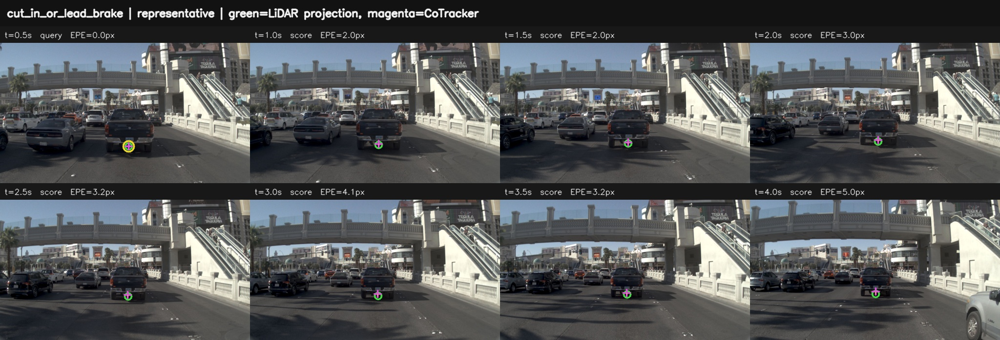
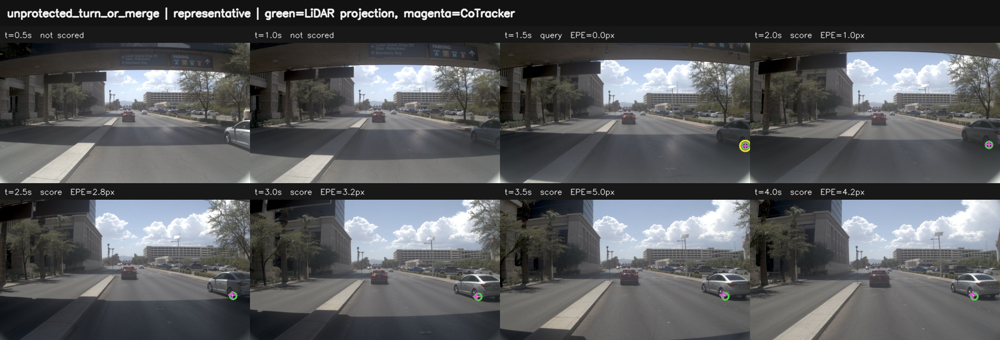
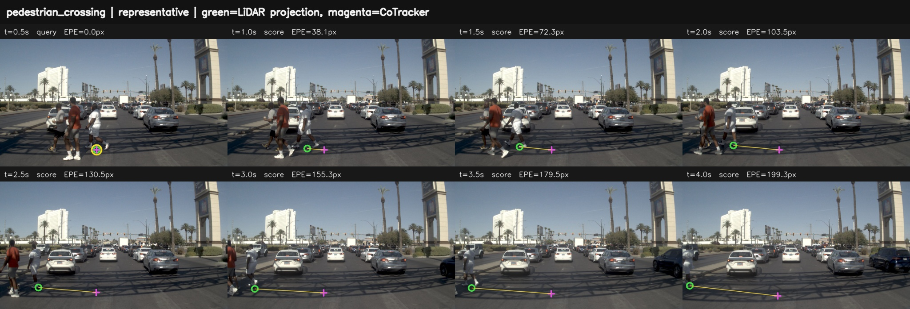
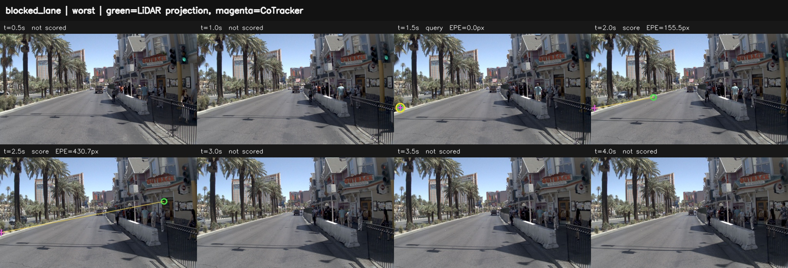

# Actor 相对运动能力 V1

## 1. 要解决的量

方向事件只能回答“想象中向哪里走”。四类交互因果链还需要回答：

- 哪个 actor 与自车发生冲突；
- actor 的纵向/横向相对距离；
- closing speed 与横向侵入速度；
- TTC、进入自车走廊时间和 gap 状态；
- 这些量在当前图像中是否可观测。

目标不是从单目视频精确恢复所有三维轨迹，而是在证据充分时输出带区间的
交互状态，在证据不足时弃权。

## 2. 方法结构

```text
history state + 8 imagined frames + camera calibration
  |                         |
  |                         +-> instance mask / actor identity
  |                                  -> 8-frame association / occlusion tracking
  |
  +-> RAFT-Large forward/backward flow
        -> static-road support and ego geometry

actor ground contact / metric depth + calibrated ground plane
  -> per-frame actor position in instantaneous ego coordinates
  -> robust temporal fit
  -> d_long, d_lat, closing speed, lateral speed
  -> TTC / time-to-corridor / gap state
  -> observability, interval posterior, abstention
  -> interaction event posterior
  -> compare with action event and independently measured realization
```

这里有两条不同职责的视觉支路：

- `RAFT-Large` 支路提供静态地面、自车运动和局部连续运动证据；
- 长程 tracker 支路维持 actor 身份并处理遮挡。

RAFT 不能替代 actor association，tracker 也不能提供可靠米制尺度。二者必须由标定地面
几何连接。单目 metric depth 只能作为辅助或 challenger，不能当作真值。

## 3. 无泄漏数据接口

固定输入协议为 4 秒、8 帧，时刻 `0.5, 1.0, ..., 4.0 s`：

```text
future_images:       8 x RGB
future_timestamps:   精确时间戳
history_ego_state:   t <= 0 的 pose/speed/acceleration/yaw_rate
history_waypoints:   仅 t <= 0
camera:              intrinsics/extrinsics/distortion
```

禁止输入 action head 的未来 waypoint、候选轨迹或未来控制量。它们只能在事件提取完成后
作为被比较对象。否则评测器可以从动作反推出事件，`future -> action` 的因果检验失效。

actor 轨迹估计器的 JSONL 输入为：

```json
{"sample_id":"s1","actor_id":"vehicle-7","class_label":"vehicle","times_s":[0.5,1.0,1.5],"positions_ego_m":[[18.0,0.2],[16.5,0.1],[15.0,0.0]],"visibility":[true,true,true],"confidence":[0.9,0.9,0.8]}
```

`positions_ego_m[t]` 表示 actor 在该时刻瞬时自车坐标系中的 `[longitudinal, lateral]`。
它可以来自标定地面接触点，或带可靠性标签的米制深度回投影。

当位置来自 CoTracker3 时，先用 `observe(..., query_points=...)` 跟踪 detector/segmenter
提供的 actor anchor，再用 `actor_pixel_tracks_from_observation` 按 `query_index` 取出每个
actor 的轨迹。查询点坐标属于 tracker 的 resized 图像，因此投影前必须用同一 resize 比例
缩放相机内参；身份关联和遮挡标记由 detector/tracker 提供，不能由后续速度拟合猜测。

执行：

```bash
PYTHONPATH=src python scripts/estimate_actor_relative_motion.py \
  --tracks actor_tracks.jsonl --require-eight-frame-four-second \
  --output actor_relative_posteriors.jsonl
```

输出包含距离、closing/lateral speed 的 `q05/q50/q95`，纵向 `ttc_s`、结合横向走廊的
`corridor_conflict_ttc_s`、进入走廊时间、拟合残差、
可观测性和弃权原因，并明确记录 `candidate_bank_used=false`、
`future_action_used=false`。

## 4. 正式比较协议

真值必须独立来自数据集 actor state、LiDAR/radar 或人工校核，不能来自被评测 WAM 的动作。
评分 JSONL 每行至少包含：

```json
{"predicted_distance_m":15.1,"reference_distance_m":15.0,"predicted_closing_speed_mps":3.1,"reference_closing_speed_mps":3.0,"predicted_ttc_s":4.87,"reference_ttc_s":5.0,"observability":0.82,"abstain":false}
```

执行：

```bash
PYTHONPATH=src python scripts/evaluate_relative_motion_metrics.py \
  --records relative_motion_gold_pairs.jsonl \
  --output relative_motion_metrics.json
```

正式报告同时给出：

- distance MAE；
- closing-speed MAE；
- 接近/远离/静止方向准确率；
- 危险 TTC F1；
- coverage；
- coverage-risk 曲线。

`ttc_s` 仅表示纵向接近；只有 actor 已在走廊内，或预计在纵向 TTC 之前进入走廊时，
才产生 `corridor_conflict_ttc_s`。四类交互链的危险 TTC 应优先使用后者。

只报告高置信样本的误差会产生选择偏差，因此误差必须与 coverage 同时出现。缺字段、NaN、
时间跨度不足或支持不足都按弃权处理。
评分器会排除任何 `future_action_used=true` 或 `candidate_bank_used=true` 的记录，并将
`formal_ready=false` 写入报告；这种记录不能进入正式因果指标。

## 5. RAFT-Large 与 SEA-RAFT 的 78 样本 A/B

这次 A/B 使用现有冻结的 NAVSIM 78 样本、4 个未来时刻、约 2 秒协议。除 flow backend 外，
连续解码器和事件阈值一致。

| 指标 | RAFT-Large | SEA-RAFT | 结论 |
|---|---:|---:|---|
| 成功解码 | 78/78 | 77/78 | RAFT-Large 更稳健 |
| 联合误差 | 0.4314 | 0.6462 | RAFT-Large 更好 |
| 横向 MAE / m | 0.1350 | 0.2236 | RAFT-Large 更好 |
| yaw MAE / rad | 0.0090 | 0.0231 | RAFT-Large 更好 |
| speed relative error | 0.3072 | 0.2915 | SEA-RAFT 小幅更好 |
| 横向事件 accuracy | 0.9776 | 0.9675 | RAFT-Large 更好 |
| 横向事件 macro-F1 | 0.9744 | 0.9643 | RAFT-Large 更好 |
| 纵向诊断 accuracy | 0.6250 | 0.6721 | SEA-RAFT 更好，但仍非正式指标 |

因此：

- 正式图像事件基线继续使用 RAFT-Large；
- SEA-RAFT 保留为速度侧 challenger，不进入默认配置；
- 这组 A/B 不能证明 4 秒 actor 相对速度有效，因为它没有 8 帧 actor-level 真值。

## 6. 当前证据与下一道门

已完成：SEA-RAFT 后端修复、同协议 A/B、actor 相对运动拟合、区间/弃权协议和正式评分器。

已经完成 CoTracker3 oracle 初始化的 actor track 能力上界；尚未完成的是盲检测/关联，以及
包含真实危险冲突正例的数据集。只有同时通过以下门槛，相对速度才能升级为正式因果指标：

1. actor association 在遮挡和重新出现时保持身份；
2. distance/closing-speed 在独立真值上达到预注册误差门槛；
3. 危险 TTC F1 不靠类别失衡获得；
4. coverage-risk 随高置信筛选单调改善；
5. 不读取未来 action waypoint。

下一实验应补齐危险冲突正例，并运行：CoTracker3 oracle 上界、盲 detector+tracker、加 metric
depth、SpatialTrackerV2 challenger。不能直接沿用 2 秒 ego 事件结果冒充相对速度验证。

## 7. 首版独立参考集（服务器实测）

2026-08-27 在服务器已有的 NuPlan mini（NAVSIM 传感器目录）上运行
`scripts/build_actor_motion_manifest.py`，得到 `results/actor_motion_reference_v1_20260827/`：

- 40 条记录，`blocked_lane / cut_in_or_lead_brake / pedestrian_crossing /
  unprotected_turn_or_merge` 各 10 条；
- 每条 4 个 history + 8 个 future 前视图，未来时间严格为 `0.5...4.0 s`；
- 独立真值来自 `lidar_box` 中心和 `ego_pose`，不是 WAM action；
- 32 条轨迹达到 usable observability，8 条为 uncertain，构建审计无错误；
- actor 类别包括 vehicle、pedestrian、generic_object、czone_sign。

这是一份能力验证参考集，不是 WAM 生成视频集，也不能直接给出
Counterfactual Consistency/Foresight-Conditioned Success。服务器当前未发现可直接读取的
Waymo TFRecord/actor manifest，因此 Waymo 分支仍需单独导出到同一 JSONL 协议后再合并，不能
把 NuPlan/NAVSIM 结果标成 Waymo 结果。

## 8. 图像可见、场景去重的 V2 与 CoTracker3 上界

同日构建 `results/actor_motion_reference_v2_image_visible_20260827/`。V2 不再把 LiDAR 中存在
等同于前视图像可见，并新增每帧 `image_visibility` 与畸变图像坐标中的
`ground_contact_pixels_uv`。固定约束为：

- 四链各 10 条、共 40 条，严格 8 帧/4 秒；
- 每条至少 3 帧真实前视可见；
- 每个 chain/scene 最多 1 条，每个 chain/log 最多 2 条；
- 四类分别覆盖 7/7/9/8 个日志和各 10 个 scene；
- audit 为 `formal_ready=true, image_tracking_ready=true`；
- manifest SHA256 为 `acc63a8da4cc3eb7a5d866b3cfa04a2ac2dd09e89c205834915ab6d65c5b2a1b`。

CoTracker3-offline 使用官方 `scaled_offline.pth`，SHA256 为
`2670d4562ed69326dda775a26e54883925cd11b6fc9b24cb7aa9f8078bce7834`。
目标在首次图像可见帧由 LiDAR ground contact oracle 初始化；初始化帧和此前帧均不计分，
因此该实验是 tracker+geometry 的能力上界，不是最终盲评指标。没有读取未来 action 或候选轨迹。

| chain | 有效帧覆盖率 | distance MAE / m | closing-speed MAE / m/s | closing sign acc. |
|---|---:|---:|---:|---:|
| 全部 | 0.7617 | 3.1219 | 0.6249 | 0.8282 |
| cut-in / lead brake | 1.0000 | 1.8394 | **0.0953** | 0.9429 |
| blocked lane | 0.4375 | 8.8675 | 2.7439 | 0.5238 |
| pedestrian crossing | 0.7273 | 2.9968 | 0.9743 | 0.6562 |
| unprotected turn / merge | 0.7692 | 2.4500 | **0.1599** | 0.9250 |

结论不是“相对速度整体可用”，而是：

1. `cut-in / lead brake` 的 closing speed 已达到正式指标候选水平；
2. `unprotected turn / merge` 在弃权后可作为辅助证据；
3. `blocked lane` 应评 obstruction occupancy / clearance，而不是强行评 actor speed；
4. pedestrian 需要目标区域/多点跟踪和更可靠深度，单 ground-contact point 尚不够；
5. 当前 40 条中独立真值的 `corridor_conflict_ttc <= 4 s` 正例为 0，因此 TTC recall/F1
   必须报告为 `null`，不能声称已验证危险 TTC。

服务器结果 `cotracker_oracle_full.json` 包含按链拆分、coverage-risk 和每帧像素轨迹；
`scripts/render_cotracker_actor_motion.py` 可生成代表样本与失败样本叠图。

绿色圆圈是独立 LiDAR box ground-contact 投影，紫色十字是 CoTracker，黄色线为像素误差；
带黄色外圈的帧只用于 oracle 初始化，不进入评分。

**cut-in / lead brake 代表样本：车辆落地点在 4 秒内保持一致。**



**unprotected turn / merge 代表样本：可跟踪，但米制误差仍受地面投影尺度放大。**



**pedestrian 代表失败：单点锁住脚下/路面纹理，没有随人体移动。**



**blocked-lane 最坏失败：边缘首次出现后发生错误关联。**


